# Releasing

This guide covers the automated release process and how releases are created.

---

## Overview

Releases are **fully automated** via [release-please](https://github.com/googleapis/release-please). The workflow:

1. Conventional commits land on `main` (via rebase+merge)
2. release-please creates a **Release PR** with version bump + CHANGELOG update
3. You review/edit the Release PR and merge it
4. release-please creates a **git tag** and **GitHub Release**
5. The tag triggers the [release workflow](../.github/workflows/release.yml) which builds, publishes, and attaches artifacts

**No manual version bumping, tagging, or CHANGELOG editing required.**

### Release Flow at a Glance


> **Pre-commit hooks** — see [`.pre-commit-config.yaml`](../.pre-commit-config.yaml) for the full list of hooks that run on each commit (Ruff, mypy, bandit, commitizen, etc.).

### Version Bump Rules

```mermaid
%%{init: {'theme': 'dark', 'themeVariables': {'primaryColor': '#1e3a5f', 'primaryTextColor': '#e0e0e0', 'primaryBorderColor': '#5b9bd5', 'lineColor': '#5b9bd5', 'edgeLabelBackground': '#0d1f36', 'clusterBkg': '#162d4a', 'clusterBorder': '#5b9bd5'}}}%%
flowchart LR
    subgraph PRE[" "]
        direction TB
        PRE_title["Pre-1.0"]
        PRE_title ~~~ FIX1
        FIX1["fix: / perf:"] -->|Patch| V1["0.6.0 → 0.6.1"]
        FEAT1["feat:"] -->|Minor| V2["0.6.0 → 0.7.0"]
        BREAK1["BREAKING CHANGE"] -->|Minor ⚠️| V3["0.6.0 → 0.7.0"]
        MANUAL["Reaching 1.0.0"] -->|Manual| V4["0.x → 1.0.0"]
    end
    subgraph POST[" "]
        direction TB
        POST_title["Post-1.0"]
        POST_title ~~~ FIX2
        FIX2["fix: / perf:"] -->|Patch| V5["1.2.0 → 1.2.1"]
        FEAT2["feat:"] -->|Minor| V6["1.2.0 → 1.3.0"]
        BREAK2["BREAKING CHANGE"] -->|Major| V7["1.2.0 → 2.0.0"]
    end

    style PRE_title fill:none,stroke:none,color:#5b9bd5,font-weight:bold
    style POST_title fill:none,stroke:none,color:#5b9bd5,font-weight:bold
    style BREAK1 fill:#4a3000,stroke:#e6a817,color:#e0e0e0
    style V3 fill:#4a3000,stroke:#e6a817,color:#e0e0e0
    style MANUAL fill:#3a1a2a,stroke:#d4577a,color:#e0e0e0
    style V4 fill:#3a1a2a,stroke:#d4577a,color:#e0e0e0
```



> **Pre-1.0 note:** `bump-minor-pre-major: true` in [`release-please-config.json`](../release-please-config.json) means breaking changes bump **minor**, not major. Reaching 1.0.0 is a manual decision (edit the Release PR).

---

## Step-by-Step: Two Pull Requests

In this repo (release-please), a release involves **two PRs** — one you create manually, one release-please creates automatically.

### PR #1 — Your Feature PR

This is the PR you create for your code changes.

**1. Create a feature branch:**

First, make sure your local `main` matches the remote (fast-forward only prevents accidental merge commits):

```bash
git switch main              # switch to the main branch
git pull --ff-only           # update main (fast-forward only — no merge commits)
```

Then create a branch based on the remote tip — this removes any doubt about your base even if local `main` is stale:

```bash
git fetch origin                                # download latest commits from remote
git switch -c feature/add-login origin/main     # create + switch to a new branch off remote main
```

**Common branch naming patterns:**

| Prefix | Use for | Example |
|--------|---------|---------|
| `feature/` | New functionality | `feature/add-login` |
| `fix/` | Bug fixes | `fix/null-byte-check` |
| `chore/` | Maintenance, deps | `chore/update-ruff` |
| `docs/` | Documentation | `docs/release-guide` |
| `spike/` | Experimental / exploratory | `spike/try-fastapi` |

> **For more branch prefixes** (including `wip/`, `hotfix/`, `release/`, and others), see the [Branch Prefixes table in learning.md](notes/learning.md#branch-prefixes).
>
> **Tip:** `wip/2026-02-20-scratch` is handy when you're not sure what you'll be working on. The date helps identify stale branches, and `scratch` signals it's a temporary playground.

**Push the branch upstream** (sets tracking so future `git push` / `git pull` just work):

```bash
git push -u origin HEAD         # push branch + set upstream tracking
```

**Verify you're on the right branch:**

```bash
git branch --show-current       # print the current branch name
# or for a compact status
git status -sb                  # short status with branch info
```

> **Never push directly to main.** Branch protection requires a PR with passing checks and an approved review. (unless you haven't enabled it in your repo settings, recommended to enable it for safety. See more on why here: [ADR 023](adr/023-branch-protection-rules.md))

**2. Make conventional commits:**

```bash
git commit -m "feat: add user authentication endpoint"
git commit -m "test: add auth endpoint tests"
git commit -m "docs: document auth API"
```

The commitizen pre-commit hook validates each commit message automatically. If a commit message is invalid, the commit is blocked.

> **Why pre-commit hooks matter:** CI workflows only run when you open a PR targeting `main` — not on every push to a feature branch. Hooks are your **early feedback loop**, catching lint errors, type issues, security problems, and bad commit messages before code ever leaves your machine. Without hooks, you'd only discover these issues after opening a PR. See the [CONTRIBUTING guide](../CONTRIBUTING.md#quality-pipeline-overview) for the full quality pipeline.

| Stage | When it runs | What it catches |
|-------|-------------|-----------------|
| **Pre-commit hooks** | Every `git commit` | Ruff lint/format, mypy types, bandit security, spellcheck, file checks |
| **Commit-msg hook** | Every `git commit` | Conventional commit format (commitizen) |
| **Pre-push hook** | Every `git push` | Test suite (pytest) — catches test failures before opening a PR |
| **CI workflows** | PR opened/updated targeting `main` | Full matrix: lint, test (3.11–3.13), typecheck, security, coverage, spellcheck |
| **PR-specific checks** | PR only | PR title format, dependency review, auto-labeling |

> **Setup reminder:** All three hook stages must be installed for full local coverage:
> ```bash
> pre-commit install                          # pre-commit stage
> pre-commit install --hook-type commit-msg    # commit-msg stage
> pre-commit install --hook-type pre-push      # pre-push stage
> ```

**3. Push your branch:**

```bash
git push                          # tracking already set in step 1
```

**4. Open the PR on GitHub:**

After pushing, go to your repository on GitHub and create a pull request:

1. **Navigate to the repo** — Go to `https://github.com/OWNER/REPO` (or click the link Git prints after pushing).

2. **Start the PR** — GitHub usually shows a banner: *"your-branch had recent pushes — Compare & pull request"*. Click it. If the banner is gone, go to the **Pull requests** tab → **New pull request** → set base: `main` and compare: `your-branch`.

3. **Write the PR title** — Use conventional commit format. This is validated by the `pr-title` workflow.

    | Element | Format | Example |
    |---------|--------|---------|
    | **PR title** | Conventional commit format | `feat: add user authentication` |
    | **PR body** | Free-form for human reviewers | Describe what, why, and any context |
    | **Commits** | Conventional commit messages | The commits are what matter for releases |

4. **Fill in the PR description** — The repo includes a [PR template](../.github/PULL_REQUEST_TEMPLATE.md) that pre-fills the body with a structured checklist. Fill in:
    - **Description** — what you changed and why
    - **Related Issue** — link to an issue (`Fixes #123`) or write "N/A"
    - **Type of Change** — check the relevant box (bug fix, feature, docs, etc.)
    - **How to Test** — steps and commands so reviewers can verify your changes
    - **Checklist** — confirm you've run tests, updated docs, etc.

    > **Tip:** Copilot can help draft your PR description. When filling in the PR body on GitHub, click the **Copilot** sparkle icon in the description editor to generate a summary from your commits and diff. You can then edit the output to add context Copilot can't infer (motivation, testing notes, related issues). This is especially useful for large PRs where summarizing changes manually is tedious.

5. **Add labels** — In the right sidebar, click **Labels** and apply relevant ones (e.g., `enhancement`, `bug`, `documentation`). The `labeler` workflow also auto-applies labels based on changed file paths, but manual labels help with filtering and triage.

6. **(Optional) Request a Copilot review** — In the **Reviewers** sidebar, select **Copilot** to get an AI-powered code review. Copilot will post inline suggestions on your PR. This is optional but useful for catching issues before human review.

7. **Request human reviewers** — Add team members or maintainers in the **Reviewers** sidebar.

8. **Click "Create pull request"** — This triggers CI workflows immediately.

> **Important:** With rebase+merge, individual **commit messages** drive the CHANGELOG — not the PR title or body. The `pr-title` workflow validates your title follows conventional format for consistency, but it's the commits that release-please reads. The PR body is purely for reviewers.

> **When do CI workflows run?** Most workflows trigger on `pull_request` targeting `main`, meaning they run when you open or update a PR — not on every push to a feature branch. They also trigger on `push` to `main` itself (post-merge). A few workflows (PR title, labeler, dependency review) only run on pull requests. The `release.yml` build/publish workflow only triggers on **version tags** (e.g., `v1.2.0`) — these tags are created by release-please after you merge its Release PR, not by your feature PR. Check each workflow's `on:` trigger for specifics. See the [workflows README](../.github/workflows/README.md) for the full list.
>
> **When does release-please run?** The `release-please.yml` workflow triggers on every push to `main` — i.e., every time a PR is merged. It scans the new commits: if any are releasable (`feat:`, `fix:`, `perf:`, `revert:`, or `BREAKING CHANGE`), it creates or updates a Release PR. Non-releasable commits (`docs:`, `chore:`, `ci:`, `test:`) are ignored. You merge the Release PR when you're ready to cut a release — it accumulates entries over time.
>
> **Release-please PR already open while you're on a feature branch?** Ignore it. Finish your feature branch, open your PR, merge it to `main`. Release-please will automatically re-run and update its Release PR to include your new commits. You don't need to pull release-please changes into your branch — the Release PR only touches `CHANGELOG.md`, `__init__.py`, and `.release-please-manifest.json`, which don't conflict with normal feature work.

**5. Monitor CI checks and fix failures:**

After submitting your PR, CI workflows run automatically. Go to the **Checks** tab (or scroll to the bottom of the PR) to monitor progress.


**When a check fails:**

1. **Identify the failure** — On the PR page, failed checks show a red ✗. Click **Details** next to the failed check to open the workflow run logs.
2. **Read the logs** — Expand the failed step to see the error. Common failures:
    - **Ruff (lint/format)** — style or lint violation → run `task lint:fix` and `task fmt` locally
    - **mypy (type check)** — type error → fix type annotations or add `# type: ignore` with justification
    - **pytest (test)** — test failure → fix the test or the code under test
    - **Bandit (security)** — security issue in Python source → fix the flagged pattern
    - **pr-title** — PR title doesn't follow conventional format → edit the PR title on GitHub
    - **commit-lint** — commit messages don't follow conventional format → amend or rebase commits
    - **OpenSSF Scorecard** — repository security practices issue (see example below)
3. **Fix and push** — Make the fix locally, commit, and push to the same branch. CI re-runs automatically on every push to a PR branch. No need to close and reopen the PR.

    ```bash
    # Fix the issue locally, then:
    git add -A
    git commit -m "fix: resolve lint errors from CI"
    git push
    ```

4. **Repeat** — Keep fixing until all checks are green. Each push triggers a fresh CI run.

> **Example — OpenSSF Scorecard failure:**
> The [OpenSSF Scorecard](../.github/workflows/scorecard.yml) workflow evaluates repository security practices (branch protection, dependency pinning, signed releases, etc.). It runs on pushes to `main` and weekly. If it fails at the "Run Scorecard" step, it typically means a security practice scored low — for example, missing branch protection rules, unsigned commits, or unpinned dependencies. To fix: review the error in the Actions log, identify which scorecard check failed, and address it (e.g., enable branch protection in repo settings, pin a dependency SHA). Note that Scorecard runs against the repository's **configuration**, not just your code — some fixes require repo settings changes, not code changes.

**6. Merge:**

Once CI passes and the PR is approved, a maintainer clicks **Rebase and merge**. GitHub automatically appends `(#PR)` to each commit subject.

### PR #2 — The Release PR (Automated)

After your commits land on `main`, release-please scans them on each push.

- **If releasable commits exist** (`feat:`, `fix:`, `perf:`, `revert:`, or `BREAKING CHANGE`): release-please creates or updates a Release PR titled `chore(main): release X.Y.Z`
- **If only non-releasable commits** (`docs:`, `chore:`, `ci:`, `test:`, etc.): nothing happens

The Release PR contains auto-generated changes to:
- **CHANGELOG.md** — new entries from commit messages
- **`__init__.py`** — updated `__version__` fallback string
- **`.release-please-manifest.json`** — version tracker

**What you do with the Release PR:**

1. **Review the CHANGELOG** — clean up redundant entries, reword for clarity
2. **Edit if needed** — add context that commit messages didn't capture
3. **Merge it** — release-please then creates a git tag + GitHub Release automatically
4. The tag triggers `release.yml` which builds, publishes, and uploads artifacts

> **You don't need to merge the Release PR immediately.** It accumulates entries as more releasable commits land on `main`. Merge it when you're ready to cut a release.

---

## How It Works

### The Release PR

When releasable commits exist on `main` (i.e., commits with `feat:`, `fix:`, `perf:`, or `BREAKING CHANGE`), release-please automatically creates or updates a Release PR titled something like:

```
chore(main): release 1.2.0
```

This PR contains:
- **CHANGELOG.md** — new entries generated from commit messages
- **`__init__.py`** — updated `__version__` fallback
- **`.release-please-manifest.json`** — updated version tracker

**You can edit this PR before merging.** This is your chance to:
- Clean up redundant CHANGELOG entries
- Reword entries for clarity
- Add context that commit messages didn't capture

### Version Determination (SemVer)

release-please reads conventional commit prefixes to determine the version bump:

| Commit type | Version bump | Example |
|-------------|-------------|---------|
| `fix:` | **Patch** (0.0.X) | `fix: handle null input` |
| `feat:` | **Minor** (0.X.0) | `feat: add user login` |
| `feat!:` or `BREAKING CHANGE:` footer | **Major** (X.0.0) | `feat!: remove deprecated API` |
| `perf:` | **Patch** (0.0.X) | `perf: cache DB queries` |
| `docs:`, `chore:`, `ci:`, etc. | **No release** | Only releasable types trigger a Release PR |

> While the project is pre-1.0 (`major_version_zero: true`), breaking changes bump minor instead of major.

### What Triggers a Release

A Release PR is created/updated when **any** of these commit types land on `main`:
- `feat:` — new features
- `fix:` — bug fixes
- `perf:` — performance improvements
- `revert:` — reverted changes
- Any commit with a `BREAKING CHANGE:` footer

Commits with `docs:`, `chore:`, `ci:`, `test:`, `refactor:`, `style:`, `build:` **do not** trigger releases on their own (they are hidden from the CHANGELOG by default).

### CHANGELOG Format

The CHANGELOG is automatically generated. With rebase+merge, each conventional commit becomes its own entry:

```markdown
## [1.2.0](https://github.com/owner/repo/compare/v1.1.0...v1.2.0) (2026-03-15)

### Features

* add user authentication module (#42)
* add login CLI command (#42)
* add password hashing utility (#43)

### Bug Fixes

* handle empty username in auth flow (#44)
* correct token expiration calculation (#44)
```

### After Merging the Release PR

When you merge the Release PR, release-please automatically:

1. Creates a git tag (e.g., `v1.2.0`)
2. Creates a GitHub Release with CHANGELOG entries as release notes

The tag then triggers the [release.yml](../.github/workflows/release.yml) workflow which:

1. Builds sdist + wheel (hatch-vcs reads the tag for version)
2. Generates SLSA build provenance attestations
3. Publishes to PyPI (if `PUBLISH_TOKEN` secret is configured)
4. Generates SPDX and CycloneDX SBOMs
5. Uploads all artifacts to the GitHub Release

---

## Tools in This Workflow

| Tool | Role | Configuration |
|------|------|---------------|
| **release-please** | Creates Release PR, bumps version, generates CHANGELOG, creates tags + GitHub Releases | `release-please-config.json`, `.release-please-manifest.json` |
| **hatch-vcs** | Derives Python package version from git tags at build time | `pyproject.toml` `[tool.hatch.version]` |
| **commitizen** | Validates commit messages locally (pre-commit hook) + interactive `cz commit` | `pyproject.toml` `[tool.commitizen]` |
| **commit-lint.yml** | CI safety net — validates all PR commits follow conventional format | `.github/workflows/commit-lint.yml` |
| **release.yml** | Builds, publishes, generates SBOMs on tag push | `.github/workflows/release.yml` |

---

## Commit Message Conventions

Since rebase+merge preserves individual commits, **every commit message matters**:

```
feat: add user login endpoint (#42)

Why: Users need to authenticate to access protected resources.

What changed: Added /api/login endpoint with JWT token generation.

How tested: Unit tests for auth module, integration test for login flow.
```

**Key conventions:**
- Use conventional prefix (`feat:`, `fix:`, etc.) for meaningful changes
- The `(#PR)` reference is added automatically by GitHub (see below)
- Use non-conventional messages for WIP/iteration (they won't appear in CHANGELOG)
- The PR description is for **human reviewers** — automation reads commits, not the PR body

### PR Linkage (Automatic)

With rebase+merge, GitHub automatically appends `(#PR)` to each commit's subject line when you merge via the web UI. **No configuration or manual effort needed.**

**The flow:**

1. You write locally: `feat: add user authentication`
2. You push and open PR #42
3. When you click "Rebase and merge", each commit becomes: `feat: add user authentication (#42)`
4. release-please reads the commit on `main` and generates CHANGELOG with `(#42)` as a clickable link

This means every commit on `main` automatically points back to its PR — preserving the review context, discussion, and approval history even though rebase+merge doesn't create merge commits.

**Optional: Issue references in commit body.** If you also want to link to issues (requirements, bug reports), add a footer:

```
feat: add user authentication

Refs: #15
```

GitHub's closing keywords (`Fixes #28`, `Closes #30`, `Resolves #15`) also work and will auto-close the referenced issue on merge.

---

## Publishing to PyPI

PyPI publishing is disabled by default. To enable:

### Setup Trusted Publishing

1. Go to [PyPI](https://pypi.org/) and create an account
2. Create a new project or claim the package name
3. Configure **Trusted Publishing**:
   - Publisher: GitHub Actions
   - Repository: `your-username/simple-python-boilerplate`
   - Workflow: `release.yml`
   - Environment: `release`

### Add the Secret

Add `PUBLISH_TOKEN` in Settings → Secrets and variables → Actions → Secrets.

### Create GitHub Environment

1. Go to **Settings → Environments** in your repository
2. Create an environment named `release`
3. (Optional) Add required reviewers for manual approval

---

## GitHub Repository Settings

Configure these settings to enforce the release workflow:

### Merge Strategy
- **Enable:** "Allow rebase merging"
- **Disable:** "Allow merge commits" and "Allow squash merging"
- **Enable:** "Automatically delete head branches"

### Branch Protection (main)
- Require status checks to pass before merging
- Require pull request reviews before merging
- Require linear history

### Repository Variables
Enable the workflows by setting these in Settings → Variables:
- `ENABLE_RELEASE_PLEASE = true`
- `ENABLE_RELEASE = true`
- `ENABLE_COMMIT_LINT = true`

### Workflow Guards Quick Reference

What runs, what doesn't, and why:

| Trigger | Workflow | Guard (must be set) | What happens |
|---------|----------|--------------------|--------------|
| Push to `main` | `release-please.yml` | `ENABLE_RELEASE_PLEASE` variable | Creates/updates a Release PR with CHANGELOG + version bump |
| PR targeting `main` | `commit-lint.yml` | `ENABLE_COMMIT_LINT` variable | Validates all PR commits follow conventional format |
| Tag push `v*.*.*` | `release.yml` → **build** job | `ENABLE_RELEASE` variable | Builds sdist + wheel, generates SLSA attestations |
| Tag push `v*.*.*` | `release.yml` → **publish** job | `PUBLISH_TOKEN` **secret** | Publishes to PyPI. **If secret is missing, skips gracefully** (workflow stays green) |
| Tag push `v*.*.*` | `release.yml` → **sbom** job | `ENABLE_RELEASE` variable | Generates SPDX + CycloneDX SBOMs |
| Tag push `v*.*.*` | `release.yml` → **upload-assets** job | `ENABLE_RELEASE` variable | Uploads dist + SBOMs to the GitHub Release |

**Key point:** Setting `ENABLE_RELEASE = true` does **not** publish to PyPI. It builds artifacts and uploads them to the GitHub Release. PyPI publishing only happens if you also add the `PUBLISH_TOKEN` secret. Without it, the publish step shows a notice and passes.

---

## Versioning

This project follows [Semantic Versioning](https://semver.org/):

| Version Part | When to Increment |
|--------------|-------------------|
| **MAJOR** (1.x.x) | Breaking API changes |
| **MINOR** (x.1.x) | New features, backward compatible |
| **PATCH** (x.x.1) | Bug fixes, backward compatible |

### Pre-release Versions

For pre-releases, use suffixes:

- `1.0.0a1` — Alpha
- `1.0.0b1` — Beta
- `1.0.0rc1` — Release candidate

### How Version Is Determined

The package version comes from **git tags** via hatch-vcs:

| Context | Version source | Example |
|---------|---------------|---------|
| Tagged release | Git tag | `1.2.0` |
| Dev build (after tag) | Tag + distance + hash | `1.2.1.dev3+gabcdef` |
| No tags exist | Fallback in `__init__.py` | `0.1.0` |
| Outside git repo | Fallback | `0.0.0+unknown` |

---

## Troubleshooting

### Release PR Not Appearing

- Ensure `ENABLE_RELEASE_PLEASE` variable is set to `true`
- Check that releasable commits exist (`feat:`, `fix:`, `perf:`, or breaking)
- Verify the release-please workflow ran successfully in the Actions tab

### Version Mismatch

- hatch-vcs derives version from the **latest tag** — ensure the tag exists
- Run `hatch version` locally to see what version hatch-vcs resolves
- The `__init__.py` fallback is only used when `_version.py` is not generated

### Build Fails

- Ensure `pyproject.toml` is valid
- Check that hatch-vcs can find a tag: `git describe --tags`
- Verify `python -m build` works locally

### Tag Already Exists

```bash
# Delete local tag
git tag -d v1.0.0

# Delete remote tag
git push origin :refs/tags/v1.0.0
```

---

## Pros and Cons of This Workflow

### Pros

- **Fully automated** — no manual version bumps, tags, or CHANGELOG editing
- **Reviewable** — Release PR can be edited before merge
- **Consistent** — SemVer enforced by commit conventions, not human judgment
- **No CHANGELOG conflicts** — generated from commits, never hand-edited on main
- **Fine-grained** — individual commits appear in CHANGELOG (rebase+merge)
- **Traceable** — commits → PRs → issues → CHANGELOG → GitHub Release

### Cons

- **Commit discipline** — every conventional commit on main appears in CHANGELOG
- **Noisy commits** — iterative fix: commits within a PR produce multiple entries (mitigated by editing Release PR)
- **Changed SHAs** — rebase+merge re-hashes commits (original branch SHAs lost)
- **No merge graph** — cannot visually see where a PR started/ended in `git log --graph`
- **Two version sources** — hatch-vcs (build-time) + `__init__.py` fallback (human-readable)
- **Google dependency** — release-please is maintained by Google

### Alternative Workflows That Could Replace Parts

| Tool | What it could replace | Trade-off |
|------|----------------------|-----------|
| **python-semantic-release** | release-please | No reviewable Release PR; pushes tags directly |
| **towncrier** | CHANGELOG generation | Fragment files per PR; can't auto-determine version |
| **git-cliff** | CHANGELOG generation | CLI only; no PR/release automation |
| **squash+merge** | rebase+merge | Cleaner but loses individual commit detail |

---

## See Also

- [Release Policy](release-policy.md) — Versioning, deprecation, and support policy
- [CHANGELOG.md](../CHANGELOG.md) — Version history
- [CONTRIBUTING.md](../CONTRIBUTING.md) — Contribution guidelines
- [ADR 021 — Automated release pipeline](adr/021-automated-release-pipeline.md)
- [ADR 022 — Rebase+merge strategy](adr/022-rebase-merge-strategy.md)
- [Keep a Changelog](https://keepachangelog.com/)
- [Semantic Versioning](https://semver.org/)
- [release-please](https://github.com/googleapis/release-please)
- [hatch-vcs](https://github.com/ofek/hatch-vcs)
- [commitizen](https://commitizen-tools.github.io/commitizen/)
