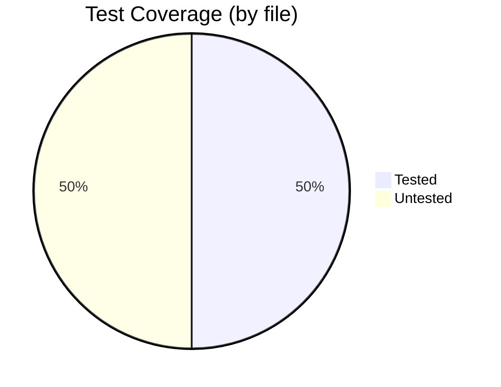
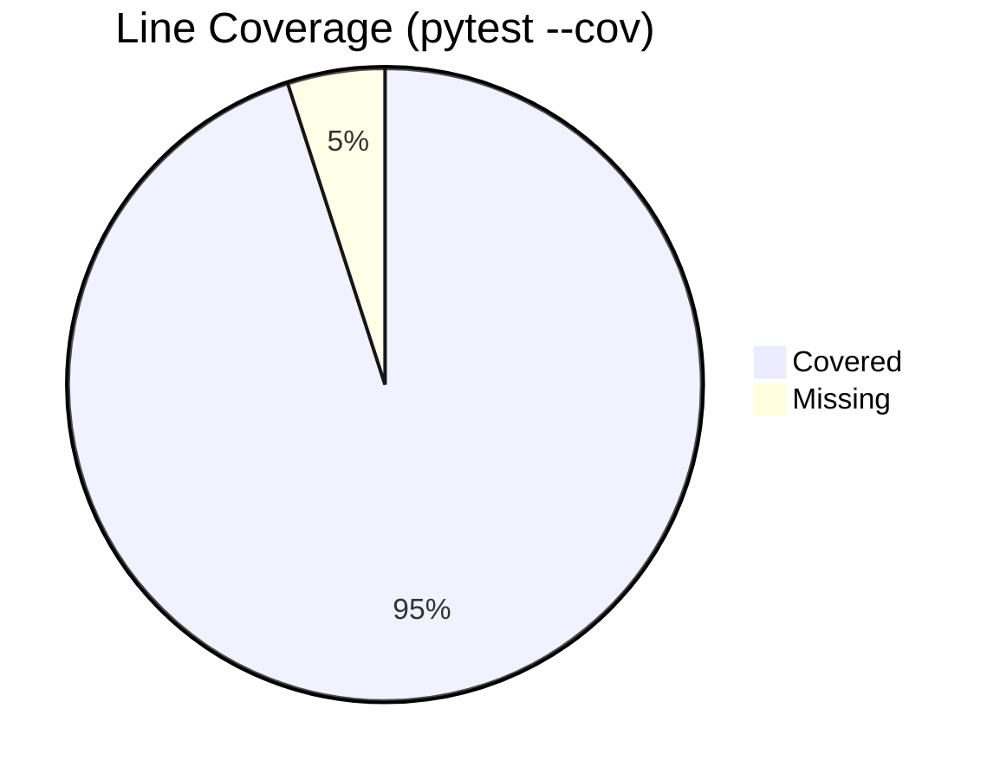

# 🔴 Repository Sauron Report — simple-python-boilerplate

> *The all-seeing eye peers into every corner of your repository.*

🕒 **Generated:** 2026-03-30 13:46:06 UTC
📦 **Version:** 4.0.0
🌿 **Branch:** `wip/2026-03-26-scratch`


---

## 📑 Table of Contents

- [Overview](#-overview)
- [Repository Health](#-repository-health)
- [Repository Structure](#-repository-structure)
- [File Types](#-file-types)
- [Languages](#-languages)
- [Code & Script Activity](#-code--script-activity)
- [Directory Sizes](#-directory-sizes)
- [Largest Files](#-largest-files)
- [Test Coverage](#-test-coverage)
- [File Access Statistics](#-file-access-statistics)
- [Git History](#-git-history)
- [Recently Modified Files](#-recently-modified-files)
- [Per-File Git Statistics](#-per-file-git-statistics)
- [Contributors](#-contributors)
- [Recommended Scripts](#-recommended-scripts)
- [Recommended VS Code Extensions](#-recommended-vs-code-extensions)

---

## 📊 Overview

> **ℹ️ Note:** High-level repository metrics at a glance.

> **Code files** count extensions: `.py`, `.sh`.
> **Script files** count extensions: `.py`, `.sh`.
> **Test files** are `.py` files inside `tests/`/`test/` dirs, or matching `test_*`/`*_test.py`/`conftest.py` patterns.

| Metric | Value |
|--------|-------|
| 📄 **Total files** | 324 |
| 📂 **Total directories** | 39 |
| 💾 **Total size** | 3.5 MB |
| 📏 **Avg file size** | 10.9 KB |
| 💻 **Code files** | 84 |
| 📜 **Script files** | 84 |
| 🧪 **Test files** | 42 |
| 📝 **Documentation files** | 137 |
| ⚙️ **Configuration files** | 76 |
| 📦 **Estimated binary files** | 18 |
| ⚠️ **Empty files (0 bytes)** | 1 |
| **Avg directory size** | 138.3 KB (32 dirs) |
| 📖 **Total lines (code + text + blanks)** | 84,432 |
| 📦 **Total git commits** | 844 |

---

## 🩺 Repository Health

> **ℹ️ Note:** Quick pass/fail checks for standard repository health indicators.

| Check                | Description                      |
| -------------------- | -------------------------------- |
| ✅ **README**         | Has a README file                |
| ✅ **LICENSE**        | Has a LICENSE file               |
| ✅ **Tests**          | Has a test directory             |
| ✅ **.gitignore**     | Has a .gitignore file            |
| ✅ **CI config**      | Has CI/CD configuration          |
| ✅ **pyproject.toml** | Has a project configuration file |
| ✅ **CONTRIBUTING**   | Has contributing guidelines      |
| ✅ **SECURITY**       | Has a security policy            |
| ✅ **CHANGELOG**      | Has a changelog                  |
| ✅ **Docs**           | Has a documentation directory    |

---

## 🌳 Repository Structure

> **💡 Tip:** This tree is **dynamically generated** by scanning the repository at runtime. It reflects the actual state of whichever git repository this script is run in — not a hard-coded snapshot.
>
> Build artifacts and caches (`*.egg-info`, `.eggs`, `.git`, `.mypy_cache`, `.pytest_cache`, `build`, `htmlcov`, `node_modules`, …) are excluded.

<details>
<summary><strong>Click to expand full repository tree</strong></summary>

```
simple-python-boilerplate/
├── db/
│   ├── migrations/
│   │   ├── 001_example_migration.sql
│   │   └── README.md
│   ├── queries/
│   │   ├── example_queries.sql
│   │   └── README.md
│   ├── seeds/
│   │   ├── 001_example_seed.sql
│   │   └── README.md
│   ├── README.md
│   └── schema.sql
├── docs/
│   ├── adr/
│   │   ├── archive/
│   │   │   └── README.md
│   │   ├── .instructions.md
│   │   ├── 001-src-layout.md
│   │   ├── 002-pyproject-toml.md
│   │   ├── 003-separate-workflow-files.md
│   │   ├── 004-pin-action-shas.md
│   │   ├── 005-ruff-for-linting-formatting.md
│   │   ├── 006-pytest-for-testing.md
│   │   ├── 007-mypy-for-type-checking.md
│   │   ├── 008-pre-commit-hooks.md
│   │   ├── 009-conventional-commits.md
│   │   ├── 010-dependabot-for-dependency-updates.md
│   │   ├── 011-repository-guard-pattern.md
│   │   ├── 012-multi-layer-security-scanning.md
│   │   ├── 013-sbom-bill-of-materials.md
│   │   ├── 014-no-template-engine.md
│   │   ├── 015-no-github-directory-readme.md
│   │   ├── 016-hatchling-and-hatch.md
│   │   ├── 017-task-runner.md
│   │   ├── 018-bandit-for-security-linting.md
│   │   ├── 019-containerfile.md
│   │   ├── 020-mkdocs-documentation-stack.md
│   │   ├── 021-automated-release-pipeline.md
│   │   ├── 022-rebase-merge-strategy.md
│   │   ├── 023-branch-protection-rules.md
│   │   ├── 024-ci-gate-pattern.md
│   │   ├── 025-container-strategy.md
│   │   ├── 026-no-pip-tools.md
│   │   ├── 027-database-strategy.md
│   │   ├── 028-git-branching-strategy.md
│   │   ├── 029-testing-strategy.md
│   │   ├── 030-label-management-as-code.md
│   │   ├── 031-script-conventions.md
│   │   ├── 032-dependency-grouping-strategy.md
│   │   ├── 033-prettier-for-markdown-formatting.md
│   │   ├── 034-documentation-organization-strategy.md
│   │   ├── 035-copilot-instructions-as-context.md
│   │   ├── 036-diagnostic-tooling-strategy.md
│   │   ├── 037-git-configuration-as-code.md
│   │   ├── 038-vscode-workspace-configuration-strategy.md
│   │   ├── 039-developer-onboarding-automation.md
│   │   ├── 040-v1-release-readiness.md
│   │   ├── README.md
│   │   └── template.md
│   ├── design/
│   │   ├── architecture.md
│   │   ├── ci-cd-design.md
│   │   ├── database.md
│   │   ├── README.md
│   │   └── tool-decisions.md
│   ├── development/
│   │   ├── branch-workflows.md
│   │   ├── command-workflows.md
│   │   ├── dev-setup.md
│   │   ├── developer-commands.md
│   │   ├── development.md
│   │   ├── pull-requests.md
│   │   └── README.md
│   ├── guide/
│   │   ├── getting-started.md
│   │   ├── README.md
│   │   └── troubleshooting.md
│   ├── notes/
│   │   ├── archive.md
│   │   ├── archive.md.bak
│   │   ├── learning.md
│   │   ├── README.md
│   │   ├── resources_links.md
│   │   ├── resources_written.md
│   │   ├── todo.md
│   │   ├── todo.md.bak
│   │   └── tool-comparison.md
│   ├── reference/
│   │   ├── api.md
│   │   ├── commands.md
│   │   ├── index.md
│   │   ├── README.md
│   │   ├── scripts.md
│   │   └── template-inventory.md
│   ├── templates/
│   │   ├── issue_templates/
│   │   │   ├── issue_forms/
│   │   │   │   ├── design_proposal.yml
│   │   │   │   ├── general.yml
│   │   │   │   ├── other.yml
│   │   │   │   ├── performance.yml
│   │   │   │   ├── question.yml
│   │   │   │   ├── refactor_request.yml
│   │   │   │   └── test_failure.yml
│   │   │   ├── legacy_markdown/
│   │   │   │   ├── bug_report.md
│   │   │   │   ├── design_proposal.md
│   │   │   │   ├── documentation.md
│   │   │   │   ├── feature_request.md
│   │   │   │   ├── general.md
│   │   │   │   ├── other.md
│   │   │   │   ├── performance.md
│   │   │   │   ├── question.md
│   │   │   │   ├── refactor_request.md
│   │   │   │   └── test_failure.md
│   │   │   └── README.md
│   │   ├── BUG_BOUNTY.md
│   │   ├── pull-request-draft.md
│   │   ├── README.md
│   │   ├── SECURITY_no_bounty.md
│   │   └── SECURITY_with_bounty.md
│   ├── .instructions.md
│   ├── index.md
│   ├── known-issues.md
│   ├── labels.md
│   ├── README.md
│   ├── release-policy.md
│   ├── releasing.md
│   ├── repo-layout.md
│   ├── sbom.md
│   ├── tooling.md
│   ├── USING_THIS_TEMPLATE.md
│   └── workflows.md
├── experiments/
│   ├── example_api_test.py
│   ├── example_data_exploration.py
│   └── README.md
├── labels/
│   ├── baseline.json
│   └── extended.json
├── mkdocs-hooks/
│   ├── generate_commands.py
│   ├── include_templates.py
│   ├── README.md
│   └── repo_links.py
├── repo_doctor.d/
│   ├── ci.toml
│   ├── container.toml
│   ├── db.toml
│   ├── docs.toml
│   ├── python.toml
│   ├── README.md
│   └── security.toml
├── scripts/
│   ├── precommit/
│   │   ├── auto_chmod_scripts.py
│   │   ├── check_local_imports.py
│   │   ├── check_nul_bytes.py
│   │   └── README.md
│   ├── sql/
│   │   ├── README.md
│   │   ├── reset.sql
│   │   └── scratch.example.sql
│   ├── .instructions.md
│   ├── _colors.py
│   ├── _container_common.py
│   ├── _doctor_common.py
│   ├── _imports.py
│   ├── _progress.py
│   ├── _ui.py
│   ├── apply-labels.sh
│   ├── apply_labels.py
│   ├── archive_todos.py
│   ├── bootstrap.py
│   ├── changelog_check.py
│   ├── check_known_issues.py
│   ├── check_python_support.py
│   ├── check_todos.py
│   ├── clean.py
│   ├── customize.py
│   ├── dep_versions.py
│   ├── doctor.py
│   ├── env_doctor.py
│   ├── env_inspect.py
│   ├── generate_command_reference.py
│   ├── git_doctor.py
│   ├── README.md
│   ├── repo_doctor.py
│   ├── repo_sauron.py
│   ├── test_containerfile.py
│   ├── test_containerfile.sh
│   ├── test_docker_compose.py
│   ├── test_docker_compose.sh
│   └── workflow_versions.py
├── src/
│   ├── simple_python_boilerplate/
│   │   ├── dev_tools/
│   │   │   └── __init__.py
│   │   ├── sql/
│   │   │   ├── __init__.py
│   │   │   ├── example_query.sql
│   │   │   └── README.md
│   │   ├── __init__.py
│   │   ├── _version.py
│   │   ├── api.py
│   │   ├── cli.py
│   │   ├── engine.py
│   │   ├── main.py
│   │   └── py.typed
│   └── README.md
├── tests/
│   ├── integration/
│   │   ├── sql/
│   │   │   ├── README.md
│   │   │   ├── setup_test_db.sql
│   │   │   └── teardown_test_db.sql
│   │   ├── __init__.py
│   │   ├── conftest.py
│   │   ├── test_cli_smoke.py
│   │   └── test_db_example.py
│   ├── unit/
│   │   ├── __init__.py
│   │   ├── conftest.py
│   │   ├── test_api.py
│   │   ├── test_apply_labels.py
│   │   ├── test_archive_todos.py
│   │   ├── test_bootstrap.py
│   │   ├── test_changelog_check.py
│   │   ├── test_check_known_issues.py
│   │   ├── test_check_nul_bytes.py
│   │   ├── test_check_todos.py
│   │   ├── test_clean.py
│   │   ├── test_colors.py
│   │   ├── test_customize.py
│   │   ├── test_customize_interactive.py
│   │   ├── test_dep_versions.py
│   │   ├── test_doctor.py
│   │   ├── test_doctor_common.py
│   │   ├── test_env_doctor.py
│   │   ├── test_example.py
│   │   ├── test_generate_command_reference.py
│   │   ├── test_generate_commands.py
│   │   ├── test_git_doctor.py
│   │   ├── test_imports.py
│   │   ├── test_include_templates.py
│   │   ├── test_init_fallback.py
│   │   ├── test_main_entry.py
│   │   ├── test_progress.py
│   │   ├── test_repo_doctor.py
│   │   ├── test_repo_links.py
│   │   ├── test_test_containerfile.py
│   │   ├── test_test_docker_compose.py
│   │   ├── test_ui.py
│   │   ├── test_version.py
│   │   └── test_workflow_versions.py
│   ├── .instructions.md
│   ├── conftest.py
│   └── README.md
├── var/
│   ├── app.example.sqlite3
│   └── README.md
├── .containerignore
├── .dockerignore
├── .editorconfig
├── .gitattributes
├── .gitconfig.recommended
├── .gitignore
├── .gitmessage.txt
├── .lycheeignore
├── .markdownlint-cli2.jsonc
├── .pre-commit-config.yaml
├── .prettierignore
├── .readthedocs.yaml
├── .release-please-manifest.json
├── .repo-doctor.toml
├── _typos.toml
├── CHANGELOG.md
├── CODE_OF_CONDUCT.md
├── codecov.yml
├── commit-report.md
├── container-structure-test.yml
├── Containerfile
├── CONTRIBUTING.md
├── coverage.json
├── customize-config.md
├── docker-compose.yml
├── git-config-reference.md
├── LICENSE
├── mkdocs.yml
├── pgp-key.asc
├── pyproject.toml
├── README.md
├── release-please-config.json
├── repo-sauron-report.md
├── requirements-dev.txt
├── requirements.txt
├── SECURITY.md
├── simple-python-boilerplate.code-workspace
├── Taskfile.yml
└── test-config-ref.md
```

</details>

---

## 📁 File Types

> **💡 Tip:** Most common file extensions in the repository.
>
> **Lines** = raw newline-separated line count including code, comments, blank lines, and whitespace-only lines. Counted for text-based file types only.

| Extension                                                                                       | Files | Lines  |
| ----------------------------------------------------------------------------------------------- | ----: | -----: |
|  |   134 | 34,068 |
|    |    81 | 37,537 |
|                              |    57 |  8,606 |
| 📄                                                                                               |    10 |      — |
|                            |     9 |  2,143 |
|                              |     9 |    333 |
|                            |     8 |    945 |
|                              |     3 |    135 |
|   |     3 |    172 |
|                            |     2 |    493 |
| 📄                                                                                               |     2 |      — |
| 📄                                                                                               |     1 |      — |
| 📄                                                                                               |     1 |      — |
| 📄                                                                                               |     1 |      — |
| 📄                                                                                               |     1 |      — |

---

## 🗣️ Languages

> **ℹ️ Note:** Language breakdown by file count (percentage of recognized files).
>
> **Lines** = total newline-separated lines (code + comments + blanks). Languages are identified by file extension.

| Language                                                                                                    | Files | Lines  | %     |
| ----------------------------------------------------------------------------------------------------------- | ----: | -----: | ----: |
|    |   134 | 34,068 | 43.6% |
|          |    81 | 37,537 | 26.4% |
|                                          |    59 |  9,099 | 19.2% |
|                                          |     9 |  2,143 |  2.9% |
|                                            |     9 |    333 |  2.9% |
|                                          |     8 |    945 |  2.6% |
|                            |     3 |    135 |  1.0% |
|           |     3 |    172 |  1.0% |
|  |     1 |      — |  0.3% |

```diff
+ Markdown             █████████████████████ 43.6%
+ Python               █████████████ 26.4%
+ YAML                 █████████ 19.2%
+ TOML                 █ 2.9%
+ SQL                  █ 2.9%
+ JSON                 █ 2.6%
+ Plain Text           █ 1.0%
+ Shell                █ 1.0%
+ Dockerfile           █ 0.3%
```

---

## ⚡ Code & Script Activity

> **ℹ️ Note:** Commit frequency per file as a proxy for how actively code
> and scripts are used/developed.
> Files with more commits are being changed (and likely run) more frequently.

### Code Files (by commit activity)

| File                                        | Commits | Last Commit |
| ------------------------------------------- | ------: | ----------- |
| `scripts/git_doctor.py`                     |      50 | 2026-03-29  |
| `scripts/workflow_versions.py`              |      30 | 2026-03-30  |
| `scripts/bootstrap.py`                      |      26 | 2026-03-30  |
| `scripts/customize.py`                      |      26 | 2026-03-30  |
| `scripts/repo_doctor.py`                    |      24 | 2026-03-30  |
| `scripts/apply_labels.py`                   |      24 | 2026-03-29  |
| `scripts/dep_versions.py`                   |      23 | 2026-03-29  |
| `scripts/env_doctor.py`                     |      22 | 2026-03-29  |
| `scripts/clean.py`                          |      19 | 2026-03-29  |
| `scripts/check_todos.py`                    |      17 | 2026-03-30  |
| `scripts/doctor.py`                         |      17 | 2026-03-29  |
| `scripts/generate_command_reference.py`     |      17 | 2026-03-29  |
| `scripts/changelog_check.py`                |      13 | 2026-03-29  |
| `scripts/check_known_issues.py`             |      13 | 2026-03-29  |
| `scripts/archive_todos.py`                  |      12 | 2026-03-29  |
| `scripts/_progress.py`                      |      12 | 2026-03-28  |
| `src/simple_python_boilerplate/__init__.py` |      12 | 2026-03-19  |
| `scripts/repo_sauron.py`                    |      11 | 2026-03-29  |
| `src/simple_python_boilerplate/main.py`     |      10 | 2026-03-30  |
| `scripts/_ui.py`                            |      10 | 2026-03-30  |

### Script Files (by commit activity)

| Script                                      | Commits | Last Commit |
| ------------------------------------------- | ------: | ----------- |
| `scripts/git_doctor.py`                     |      50 | 2026-03-29  |
| `scripts/workflow_versions.py`              |      30 | 2026-03-30  |
| `scripts/bootstrap.py`                      |      26 | 2026-03-30  |
| `scripts/customize.py`                      |      26 | 2026-03-30  |
| `scripts/repo_doctor.py`                    |      24 | 2026-03-30  |
| `scripts/apply_labels.py`                   |      24 | 2026-03-29  |
| `scripts/dep_versions.py`                   |      23 | 2026-03-29  |
| `scripts/env_doctor.py`                     |      22 | 2026-03-29  |
| `scripts/clean.py`                          |      19 | 2026-03-29  |
| `scripts/check_todos.py`                    |      17 | 2026-03-30  |
| `scripts/doctor.py`                         |      17 | 2026-03-29  |
| `scripts/generate_command_reference.py`     |      17 | 2026-03-29  |
| `scripts/changelog_check.py`                |      13 | 2026-03-29  |
| `scripts/check_known_issues.py`             |      13 | 2026-03-29  |
| `scripts/archive_todos.py`                  |      12 | 2026-03-29  |
| `scripts/_progress.py`                      |      12 | 2026-03-28  |
| `src/simple_python_boilerplate/__init__.py` |      12 | 2026-03-19  |
| `scripts/repo_sauron.py`                    |      11 | 2026-03-29  |
| `src/simple_python_boilerplate/main.py`     |      10 | 2026-03-30  |
| `scripts/_ui.py`                            |      10 | 2026-03-30  |

---

## 📦 Directory Sizes

> **ℹ️ Note:** All 32 directories sorted by size (largest first). Each directory's size includes all files in all nested subdirectories, not just immediate children.

<details>
<summary><strong>Click to expand directory sizes</strong></summary>

| Directory                                         | Size     | Files |
| ------------------------------------------------- | -------: | ----: |
| `docs/`                                           |   1.3 MB |   109 |
| `scripts/`                                        | 898.7 KB |    38 |
| `docs\notes/`                                     | 433.0 KB |     9 |
| `tests/`                                          | 359.2 KB |    44 |
| `tests\unit/`                                     | 339.0 KB |    34 |
| `docs\adr/`                                       | 206.8 KB |    44 |
| `docs\templates/`                                 | 149.3 KB |    23 |
| `docs\templates\issue_templates/`                 | 106.2 KB |    18 |
| `docs\development/`                               |  99.7 KB |     7 |
| `docs\design/`                                    |  78.0 KB |     5 |
| `docs\reference/`                                 |  72.8 KB |     6 |
| `docs\templates\issue_templates\issue_forms/`     |  67.8 KB |     7 |
| `docs\guide/`                                     |  44.2 KB |     3 |
| `repo_doctor.d/`                                  |  35.5 KB |     7 |
| `docs\templates\issue_templates\legacy_markdown/` |  34.8 KB |    10 |
| `mkdocs-hooks/`                                   |  28.4 KB |     4 |
| `var/`                                            |  25.5 KB |     2 |
| `src/`                                            |  20.9 KB |    12 |
| `src\simple_python_boilerplate/`                  |  16.9 KB |    11 |
| `db/`                                             |  16.1 KB |     8 |
| `tests\integration/`                              |  15.0 KB |     7 |
| `labels/`                                         |  11.2 KB |     2 |
| `scripts\precommit/`                              |  10.9 KB |     4 |
| `tests\integration\sql/`                          |   6.8 KB |     3 |
| `db\queries/`                                     |   5.2 KB |     2 |
| `db\migrations/`                                  |   3.2 KB |     2 |
| `experiments/`                                    |   3.0 KB |     3 |
| `db\seeds/`                                       |   2.4 KB |     2 |
| `scripts\sql/`                                    |   2.2 KB |     3 |
| `src\simple_python_boilerplate\sql/`              |   1.9 KB |     3 |
| `docs\adr\archive/`                               |   1.2 KB |     1 |
| `src\simple_python_boilerplate\dev_tools/`        |     52 B |     1 |

</details>

---

## 🐘 Largest Files

> **❗ Important:** Individual files sorted by size (top 15).

| File                                   | Size     |
| -------------------------------------- | -------: |
| `docs\notes\learning.md`               | 322.5 KB |
| `scripts\git_doctor.py`                | 247.6 KB |
| `scripts\customize.py`                 |  95.1 KB |
| `git-config-reference.md`              |  87.1 KB |
| `docs\USING_THIS_TEMPLATE.md`          |  85.9 KB |
| `repo-sauron-report.md`                |  79.3 KB |
| `scripts\repo_sauron.py`               |  75.6 KB |
| `CHANGELOG.md`                         |  51.7 KB |
| `scripts\workflow_versions.py`         |  49.2 KB |
| `docs\development\branch-workflows.md` |  47.4 KB |
| `scripts\env_inspect.py`               |  46.5 KB |
| `docs\releasing.md`                    |  46.0 KB |
| `docs\reference\commands.md`           |  45.9 KB |
| `scripts\env_doctor.py`                |  43.4 KB |
| `tests\unit\test_workflow_versions.py` |  41.8 KB |

---

## 🧪 Test Coverage

> **ℹ️ Note:** Heuristic coverage analysis — each source code file is checked for a corresponding `test_<name>` or `<name>_test` file in the test directories.
> Line/branch coverage from `pytest --cov` is shown below.

| Metric | Value |
|--------|-------|
| 📁 **Source code files** | 40 |
| ✅ **Files with tests** | 20 |
| ❌ **Files without tests** | 20 |
| 📊 **Coverage (by file)** | 50.0% |



<details>
<summary><strong>Click to expand untested source files (20 files)</strong></summary>

- `experiments\example_data_exploration.py`
- `scripts\_colors.py`
- `scripts\_container_common.py`
- `scripts\_doctor_common.py`
- `scripts\_imports.py`
- `scripts\_progress.py`
- `scripts\_ui.py`
- `scripts\apply-labels.sh`
- `scripts\check_python_support.py`
- `scripts\env_inspect.py`
- `scripts\precommit\auto_chmod_scripts.py`
- `scripts\precommit\check_local_imports.py`
- `scripts\repo_sauron.py`
- `src\simple_python_boilerplate\__init__.py`
- `src\simple_python_boilerplate\_version.py`
- `src\simple_python_boilerplate\cli.py`
- `src\simple_python_boilerplate\dev_tools\__init__.py`
- `src\simple_python_boilerplate\engine.py`
- `src\simple_python_boilerplate\main.py`
- `src\simple_python_boilerplate\sql\__init__.py`

</details>

### 📊 Line & Branch Coverage (pytest --cov)

> **Source:** `coverage.json` found in repository root.

| Metric | Value |
|--------|-------|
| 📏 **Statements** | 161 |
| ✅ **Covered lines** | 153 |
| ❌ **Missing lines** | 8 |
| 📊 **Line coverage** | 94.2% |
| 🔀 **Branches** | 28 |
| ✅ **Covered branches** | 25 |
| 🔀 **Branch coverage** | 89.3% |



<details>
<summary><strong>Click to expand files below 100% coverage (showing 4 of 4)</strong></summary>

| File | Coverage | Lines |
|------|----------|-------|
| `src\simple_python_boilerplate\__init__.py` | 91.3% | 16/17 |
| `src\simple_python_boilerplate\cli.py` | 92.5% | 38/41 |
| `src\simple_python_boilerplate\engine.py` | 93.2% | 39/42 |
| `src\simple_python_boilerplate\main.py` | 96.2% | 43/44 |

</details>

---

## 🕐 File Access Statistics

> **⚠️ Warning:** File access times (`atime`) depend on OS/filesystem configuration.
>
> **`relatime`** — access times updated approximately once per day or when file is modified (common Linux default).
> **`noatime`** — access times are never updated on read (performance optimization, timestamps may be stale).
> **`strictatime`** — access times updated on every read (most accurate but slowest).
>
> **Detected policy:** NTFS — last access updates are typically disabled by default since Windows Vista/Server 2008. Check with: `fsutil behavior query disablelastaccess`
>
> **Detection method:** `atime`/`mtime` gathered via Python `pathlib.Path.stat()` (OS-level `stat(2)` syscall).
> **Policy detection:** atime policy based on known NTFS defaults (typically disabled since Vista/Server 2008; verify with `fsutil behavior query disablelastaccess`).

<details>
<summary><strong>Click to expand file access stats (324 files)</strong></summary>

| File                                                                 | Last Accessed (atime)   | Last Modified (mtime)   |
| -------------------------------------------------------------------- | ----------------------- | ----------------------- |
| `.gitattributes`                                                     | 2026-03-30 13:46:06 UTC | 2026-03-06 20:54:03 UTC |
| `simple-python-boilerplate.code-workspace`                           | 2026-03-30 13:46:06 UTC | 2026-03-27 19:59:54 UTC |
| `.vscode\settings.json`                                              | 2026-03-30 13:46:05 UTC | 2026-03-26 13:59:54 UTC |
| `.vscode\extensions.json`                                            | 2026-03-30 13:46:05 UTC | 2026-03-27 19:59:54 UTC |
| `var\README.md`                                                      | 2026-03-30 13:46:05 UTC | 2026-03-06 20:54:03 UTC |
| `tests\unit\__init__.py`                                             | 2026-03-30 13:46:05 UTC | 2026-03-06 20:54:03 UTC |
| `tests\unit\test_version.py`                                         | 2026-03-30 13:46:05 UTC | 2026-02-23 21:03:31 UTC |
| `tests\unit\test_workflow_versions.py`                               | 2026-03-30 13:46:05 UTC | 2026-03-30 13:03:19 UTC |
| `tests\unit\test_test_docker_compose.py`                             | 2026-03-30 13:46:05 UTC | 2026-03-19 14:42:09 UTC |
| `tests\unit\test_ui.py`                                              | 2026-03-30 13:46:05 UTC | 2026-03-27 14:27:15 UTC |
| `tests\unit\test_repo_links.py`                                      | 2026-03-30 13:46:05 UTC | 2026-02-28 23:44:52 UTC |
| `tests\unit\test_test_containerfile.py`                              | 2026-03-30 13:46:05 UTC | 2026-03-19 14:42:09 UTC |
| `tests\unit\test_progress.py`                                        | 2026-03-30 13:46:05 UTC | 2026-03-06 20:54:03 UTC |
| `tests\unit\test_repo_doctor.py`                                     | 2026-03-30 13:46:05 UTC | 2026-03-30 13:03:19 UTC |
| `tests\unit\test_init_fallback.py`                                   | 2026-03-30 13:46:05 UTC | 2026-03-06 20:54:03 UTC |
| `tests\unit\test_main_entry.py`                                      | 2026-03-30 13:46:05 UTC | 2026-03-06 20:54:03 UTC |
| `tests\unit\test_imports.py`                                         | 2026-03-30 13:46:05 UTC | 2026-03-13 15:51:54 UTC |
| `tests\unit\test_include_templates.py`                               | 2026-03-30 13:46:05 UTC | 2026-03-06 20:54:03 UTC |
| `tests\unit\test_generate_command_reference.py`                      | 2026-03-30 13:46:05 UTC | 2026-03-06 20:54:03 UTC |
| `tests\unit\test_git_doctor.py`                                      | 2026-03-30 13:46:05 UTC | 2026-03-13 15:51:54 UTC |
| `tests\unit\test_example.py`                                         | 2026-03-30 13:46:05 UTC | 2026-03-06 20:54:03 UTC |
| `tests\unit\test_generate_commands.py`                               | 2026-03-30 13:46:05 UTC | 2026-03-19 14:42:09 UTC |
| `tests\unit\test_doctor_common.py`                                   | 2026-03-30 13:46:05 UTC | 2026-03-06 20:54:03 UTC |
| `tests\unit\test_env_doctor.py`                                      | 2026-03-30 13:46:05 UTC | 2026-03-13 15:51:54 UTC |
| `tests\unit\test_dep_versions.py`                                    | 2026-03-30 13:46:05 UTC | 2026-02-26 16:10:46 UTC |
| `tests\unit\test_doctor.py`                                          | 2026-03-30 13:46:05 UTC | 2026-03-27 15:03:50 UTC |
| `tests\unit\test_customize.py`                                       | 2026-03-30 13:46:05 UTC | 2026-03-19 14:42:09 UTC |
| `tests\unit\test_customize_interactive.py`                           | 2026-03-30 13:46:05 UTC | 2026-03-27 00:03:44 UTC |
| `tests\unit\test_check_todos.py`                                     | 2026-03-30 13:46:05 UTC | 2026-03-27 15:03:50 UTC |
| `tests\unit\test_clean.py`                                           | 2026-03-30 13:46:05 UTC | 2026-03-06 20:54:03 UTC |
| `tests\unit\test_colors.py`                                          | 2026-03-30 13:46:05 UTC | 2026-03-06 20:54:03 UTC |
| `tests\unit\test_check_known_issues.py`                              | 2026-03-30 13:46:05 UTC | 2026-03-06 20:54:03 UTC |
| `tests\unit\test_check_nul_bytes.py`                                 | 2026-03-30 13:46:05 UTC | 2026-03-13 15:51:54 UTC |
| `tests\unit\test_bootstrap.py`                                       | 2026-03-30 13:46:05 UTC | 2026-03-13 15:51:54 UTC |
| `tests\unit\test_changelog_check.py`                                 | 2026-03-30 13:46:05 UTC | 2026-03-13 15:51:54 UTC |
| `tests\unit\test_archive_todos.py`                                   | 2026-03-30 13:46:05 UTC | 2026-02-26 16:10:46 UTC |
| `tests\unit\test_api.py`                                             | 2026-03-30 13:46:05 UTC | 2026-02-24 22:14:54 UTC |
| `tests\unit\test_apply_labels.py`                                    | 2026-03-30 13:46:05 UTC | 2026-03-13 15:51:54 UTC |
| `tests\integration\sql\teardown_test_db.sql`                         | 2026-03-30 13:46:05 UTC | 2026-03-06 20:54:03 UTC |
| `tests\unit\conftest.py`                                             | 2026-03-30 13:46:05 UTC | 2026-02-23 21:03:31 UTC |
| `tests\integration\sql\README.md`                                    | 2026-03-30 13:46:05 UTC | 2026-03-06 20:54:03 UTC |
| `tests\integration\sql\setup_test_db.sql`                            | 2026-03-30 13:46:05 UTC | 2026-03-06 20:54:03 UTC |
| `tests\integration\__init__.py`                                      | 2026-03-30 13:46:05 UTC | 2026-03-06 20:54:03 UTC |
| `tests\integration\test_cli_smoke.py`                                | 2026-03-30 13:46:05 UTC | 2026-02-23 21:03:31 UTC |
| `tests\integration\test_db_example.py`                               | 2026-03-30 13:46:05 UTC | 2026-03-06 20:54:03 UTC |
| `tests\README.md`                                                    | 2026-03-30 13:46:05 UTC | 2026-03-19 14:42:09 UTC |
| `tests\integration\conftest.py`                                      | 2026-03-30 13:46:05 UTC | 2026-02-23 21:03:31 UTC |
| `tests\.instructions.md`                                             | 2026-03-30 13:46:05 UTC | 2026-03-06 20:54:03 UTC |
| `tests\conftest.py`                                                  | 2026-03-30 13:46:05 UTC | 2026-02-28 23:44:52 UTC |
| `src\simple_python_boilerplate\sql\README.md`                        | 2026-03-30 13:46:05 UTC | 2026-03-06 20:54:03 UTC |
| `src\simple_python_boilerplate\sql\__init__.py`                      | 2026-03-30 13:46:05 UTC | 2026-03-06 20:54:03 UTC |
| `src\simple_python_boilerplate\sql\example_query.sql`                | 2026-03-30 13:46:05 UTC | 2026-03-06 20:54:03 UTC |
| `src\simple_python_boilerplate\dev_tools\__init__.py`                | 2026-03-30 13:46:05 UTC | 2026-02-17 20:33:42 UTC |
| `src\simple_python_boilerplate\_version.py`                          | 2026-03-30 13:46:05 UTC | 2026-03-30 12:39:21 UTC |
| `src\simple_python_boilerplate\__init__.py`                          | 2026-03-30 13:46:05 UTC | 2026-03-19 14:42:09 UTC |
| `src\simple_python_boilerplate\main.py`                              | 2026-03-30 13:46:05 UTC | 2026-03-30 13:17:18 UTC |
| `src\simple_python_boilerplate\engine.py`                            | 2026-03-30 13:46:05 UTC | 2026-03-27 21:04:53 UTC |
| `src\simple_python_boilerplate\cli.py`                               | 2026-03-30 13:46:05 UTC | 2026-03-27 21:04:53 UTC |
| `src\simple_python_boilerplate\api.py`                               | 2026-03-30 13:46:05 UTC | 2026-03-27 21:04:53 UTC |
| `scripts\sql\reset.sql`                                              | 2026-03-30 13:46:05 UTC | 2026-03-06 20:54:03 UTC |
| `scripts\sql\scratch.example.sql`                                    | 2026-03-30 13:46:05 UTC | 2026-03-06 20:54:03 UTC |
| `src\README.md`                                                      | 2026-03-30 13:46:05 UTC | 2026-03-19 14:42:09 UTC |
| `scripts\sql\README.md`                                              | 2026-03-30 13:46:05 UTC | 2026-03-19 14:42:09 UTC |
| `scripts\precommit\check_nul_bytes.py`                               | 2026-03-30 13:46:05 UTC | 2026-03-19 14:42:09 UTC |
| `scripts\precommit\README.md`                                        | 2026-03-30 13:46:05 UTC | 2026-03-19 14:42:09 UTC |
| `scripts\precommit\check_local_imports.py`                           | 2026-03-30 13:46:05 UTC | 2026-03-26 15:27:24 UTC |
| `scripts\precommit\auto_chmod_scripts.py`                            | 2026-03-30 13:46:05 UTC | 2026-03-26 20:40:18 UTC |
| `scripts\_progress.py`                                               | 2026-03-30 13:46:05 UTC | 2026-03-28 21:26:47 UTC |
| `scripts\_ui.py`                                                     | 2026-03-30 13:46:05 UTC | 2026-03-30 13:03:19 UTC |
| `scripts\_imports.py`                                                | 2026-03-30 13:46:05 UTC | 2026-03-06 20:54:03 UTC |
| `scripts\_container_common.py`                                       | 2026-03-30 13:46:05 UTC | 2026-03-19 14:42:09 UTC |
| `scripts\_doctor_common.py`                                          | 2026-03-30 13:46:05 UTC | 2026-03-13 15:51:54 UTC |
| `scripts\_colors.py`                                                 | 2026-03-30 13:46:05 UTC | 2026-03-27 15:03:50 UTC |
| `scripts\workflow_versions.py`                                       | 2026-03-30 13:46:05 UTC | 2026-03-30 13:03:39 UTC |
| `scripts\test_docker_compose.py`                                     | 2026-03-30 13:46:05 UTC | 2026-03-29 21:55:08 UTC |
| `scripts\test_docker_compose.sh`                                     | 2026-03-30 13:46:05 UTC | 2026-03-19 14:42:09 UTC |
| `scripts\test_containerfile.sh`                                      | 2026-03-30 13:46:05 UTC | 2026-03-19 14:42:09 UTC |
| `scripts\test_containerfile.py`                                      | 2026-03-30 13:46:05 UTC | 2026-03-29 21:55:08 UTC |
| `scripts\repo_sauron.py`                                             | 2026-03-30 13:46:05 UTC | 2026-03-29 21:55:08 UTC |
| `scripts\README.md`                                                  | 2026-03-30 13:46:05 UTC | 2026-03-26 21:48:55 UTC |
| `scripts\repo_doctor.py`                                             | 2026-03-30 13:46:05 UTC | 2026-03-30 13:17:18 UTC |
| `scripts\git_doctor.py`                                              | 2026-03-30 13:46:05 UTC | 2026-03-29 21:55:08 UTC |
| `scripts\env_inspect.py`                                             | 2026-03-30 13:46:05 UTC | 2026-03-29 21:55:08 UTC |
| `scripts\generate_command_reference.py`                              | 2026-03-30 13:46:05 UTC | 2026-03-29 21:55:08 UTC |
| `scripts\doctor.py`                                                  | 2026-03-30 13:46:05 UTC | 2026-03-29 21:55:08 UTC |
| `scripts\env_doctor.py`                                              | 2026-03-30 13:46:05 UTC | 2026-03-29 21:55:08 UTC |
| `scripts\check_todos.py`                                             | 2026-03-30 13:46:05 UTC | 2026-03-30 13:17:18 UTC |
| `scripts\clean.py`                                                   | 2026-03-30 13:46:05 UTC | 2026-03-29 21:55:08 UTC |
| `scripts\customize.py`                                               | 2026-03-30 13:46:05 UTC | 2026-03-30 13:17:52 UTC |
| `scripts\dep_versions.py`                                            | 2026-03-30 13:46:05 UTC | 2026-03-29 21:55:08 UTC |
| `scripts\check_known_issues.py`                                      | 2026-03-30 13:46:05 UTC | 2026-03-29 21:55:08 UTC |
| `scripts\check_python_support.py`                                    | 2026-03-30 13:46:05 UTC | 2026-03-29 21:55:08 UTC |
| `scripts\bootstrap.py`                                               | 2026-03-30 13:46:05 UTC | 2026-03-30 13:17:18 UTC |
| `scripts\changelog_check.py`                                         | 2026-03-30 13:46:05 UTC | 2026-03-29 21:55:56 UTC |
| `scripts\apply_labels.py`                                            | 2026-03-30 13:46:05 UTC | 2026-03-29 21:55:08 UTC |
| `scripts\archive_todos.py`                                           | 2026-03-30 13:46:05 UTC | 2026-03-29 21:55:08 UTC |
| `scripts\.instructions.md`                                           | 2026-03-30 13:46:05 UTC | 2026-03-27 20:23:54 UTC |
| `scripts\apply-labels.sh`                                            | 2026-03-30 13:46:05 UTC | 2026-03-06 20:54:03 UTC |
| `repo_doctor.d\security.toml`                                        | 2026-03-30 13:46:05 UTC | 2026-03-06 20:54:03 UTC |
| `repo_doctor.d\python.toml`                                          | 2026-03-30 13:46:05 UTC | 2026-03-06 20:54:03 UTC |
| `repo_doctor.d\README.md`                                            | 2026-03-30 13:46:05 UTC | 2026-03-06 20:54:03 UTC |
| `repo_doctor.d\db.toml`                                              | 2026-03-30 13:46:05 UTC | 2026-03-06 20:54:03 UTC |
| `repo_doctor.d\docs.toml`                                            | 2026-03-30 13:46:05 UTC | 2026-03-19 14:42:09 UTC |
| `repo_doctor.d\ci.toml`                                              | 2026-03-30 13:46:05 UTC | 2026-03-19 14:42:09 UTC |
| `repo_doctor.d\container.toml`                                       | 2026-03-30 13:46:05 UTC | 2026-03-19 14:42:09 UTC |
| `mkdocs-hooks\repo_links.py`                                         | 2026-03-30 13:46:05 UTC | 2026-03-06 20:54:03 UTC |
| `mkdocs-hooks\README.md`                                             | 2026-03-30 13:46:05 UTC | 2026-03-19 14:42:09 UTC |
| `mkdocs-hooks\generate_commands.py`                                  | 2026-03-30 13:46:05 UTC | 2026-03-19 14:42:09 UTC |
| `mkdocs-hooks\include_templates.py`                                  | 2026-03-30 13:46:05 UTC | 2026-03-06 20:54:03 UTC |
| `labels\extended.json`                                               | 2026-03-30 13:46:05 UTC | 2026-03-06 20:54:03 UTC |
| `experiments\README.md`                                              | 2026-03-30 13:46:05 UTC | 2026-03-06 20:54:03 UTC |
| `labels\baseline.json`                                               | 2026-03-30 13:46:05 UTC | 2026-03-06 20:54:03 UTC |
| `experiments\example_data_exploration.py`                            | 2026-03-30 13:46:05 UTC | 2026-03-27 22:13:31 UTC |
| `docs\templates\issue_templates\legacy_markdown\test_failure.md`     | 2026-03-30 13:46:05 UTC | 2026-03-06 20:54:03 UTC |
| `experiments\example_api_test.py`                                    | 2026-03-30 13:46:05 UTC | 2026-03-27 22:13:31 UTC |
| `docs\templates\issue_templates\legacy_markdown\question.md`         | 2026-03-30 13:46:05 UTC | 2026-03-06 20:54:03 UTC |
| `docs\templates\issue_templates\legacy_markdown\refactor_request.md` | 2026-03-30 13:46:05 UTC | 2026-03-06 20:54:03 UTC |
| `docs\templates\issue_templates\legacy_markdown\performance.md`      | 2026-03-30 13:46:05 UTC | 2026-03-06 20:54:03 UTC |
| `docs\templates\issue_templates\legacy_markdown\general.md`          | 2026-03-30 13:46:05 UTC | 2026-02-28 23:44:52 UTC |
| `docs\templates\issue_templates\legacy_markdown\other.md`            | 2026-03-30 13:46:05 UTC | 2026-02-28 23:44:52 UTC |
| `docs\templates\issue_templates\legacy_markdown\design_proposal.md`  | 2026-03-30 13:46:05 UTC | 2026-03-06 20:54:03 UTC |
| `docs\templates\issue_templates\legacy_markdown\documentation.md`    | 2026-03-30 13:46:05 UTC | 2026-03-06 20:54:03 UTC |
| `docs\templates\issue_templates\legacy_markdown\feature_request.md`  | 2026-03-30 13:46:05 UTC | 2026-03-06 20:54:03 UTC |
| `docs\templates\issue_templates\legacy_markdown\bug_report.md`       | 2026-03-30 13:46:05 UTC | 2026-03-06 20:54:03 UTC |
| `docs\templates\issue_templates\issue_forms\test_failure.yml`        | 2026-03-30 13:46:05 UTC | 2026-03-06 20:54:03 UTC |
| `docs\templates\issue_templates\issue_forms\refactor_request.yml`    | 2026-03-30 13:46:05 UTC | 2026-03-06 20:54:03 UTC |
| `docs\templates\issue_templates\issue_forms\performance.yml`         | 2026-03-30 13:46:05 UTC | 2026-03-06 20:54:03 UTC |
| `docs\templates\issue_templates\issue_forms\question.yml`            | 2026-03-30 13:46:05 UTC | 2026-03-06 20:54:03 UTC |
| `docs\templates\issue_templates\issue_forms\general.yml`             | 2026-03-30 13:46:05 UTC | 2026-02-23 21:03:31 UTC |
| `docs\templates\issue_templates\issue_forms\other.yml`               | 2026-03-30 13:46:05 UTC | 2026-02-23 21:03:31 UTC |
| `docs\templates\issue_templates\issue_forms\design_proposal.yml`     | 2026-03-30 13:46:05 UTC | 2026-03-06 20:54:03 UTC |
| `docs\templates\SECURITY_with_bounty.md`                             | 2026-03-30 13:46:05 UTC | 2026-03-19 14:42:09 UTC |
| `docs\templates\issue_templates\README.md`                           | 2026-03-30 13:46:05 UTC | 2026-03-19 14:42:09 UTC |
| `docs\templates\README.md`                                           | 2026-03-30 13:46:05 UTC | 2026-03-06 20:54:03 UTC |
| `docs\templates\SECURITY_no_bounty.md`                               | 2026-03-30 13:46:05 UTC | 2026-03-19 14:42:09 UTC |
| `docs\templates\BUG_BOUNTY.md`                                       | 2026-03-30 13:46:05 UTC | 2026-03-19 14:42:09 UTC |
| `docs\templates\pull-request-draft.md`                               | 2026-03-30 13:46:05 UTC | 2026-03-19 14:42:09 UTC |
| `docs\reference\scripts.md`                                          | 2026-03-30 13:46:05 UTC | 2026-03-19 14:42:09 UTC |
| `docs\reference\template-inventory.md`                               | 2026-03-30 13:46:05 UTC | 2026-03-19 14:42:09 UTC |
| `docs\reference\index.md`                                            | 2026-03-30 13:46:05 UTC | 2026-03-19 14:42:09 UTC |
| `docs\reference\README.md`                                           | 2026-03-30 13:46:05 UTC | 2026-03-19 14:42:09 UTC |
| `docs\reference\api.md`                                              | 2026-03-30 13:46:05 UTC | 2026-03-06 20:54:03 UTC |
| `docs\reference\commands.md`                                         | 2026-03-30 13:46:05 UTC | 2026-03-29 21:38:51 UTC |
| `docs\notes\tool-comparison.md`                                      | 2026-03-30 13:46:05 UTC | 2026-02-28 23:44:52 UTC |
| `docs\notes\resources_written.md`                                    | 2026-03-30 13:46:05 UTC | 2026-03-19 14:42:09 UTC |
| `docs\notes\todo.md`                                                 | 2026-03-30 13:46:05 UTC | 2026-03-19 14:42:09 UTC |
| `docs\notes\resources_links.md`                                      | 2026-03-30 13:46:05 UTC | 2026-03-13 15:51:54 UTC |
| `docs\notes\README.md`                                               | 2026-03-30 13:46:05 UTC | 2026-03-19 14:42:09 UTC |
| `docs\notes\learning.md`                                             | 2026-03-30 13:46:05 UTC | 2026-03-26 13:59:54 UTC |
| `docs\guide\getting-started.md`                                      | 2026-03-30 13:46:05 UTC | 2026-03-19 14:42:09 UTC |
| `docs\guide\README.md`                                               | 2026-03-30 13:46:05 UTC | 2026-03-19 14:42:09 UTC |
| `docs\guide\troubleshooting.md`                                      | 2026-03-30 13:46:05 UTC | 2026-03-27 21:04:53 UTC |
| `docs\notes\archive.md`                                              | 2026-03-30 13:46:05 UTC | 2026-03-19 14:42:09 UTC |
| `docs\development\README.md`                                         | 2026-03-30 13:46:05 UTC | 2026-03-19 14:42:09 UTC |
| `docs\development\development.md`                                    | 2026-03-30 13:46:05 UTC | 2026-03-26 21:48:55 UTC |
| `docs\development\pull-requests.md`                                  | 2026-03-30 13:46:05 UTC | 2026-03-19 14:42:09 UTC |
| `docs\development\developer-commands.md`                             | 2026-03-30 13:46:05 UTC | 2026-03-19 14:42:09 UTC |
| `docs\development\command-workflows.md`                              | 2026-03-30 13:46:05 UTC | 2026-03-19 14:42:09 UTC |
| `docs\development\dev-setup.md`                                      | 2026-03-30 13:46:05 UTC | 2026-03-19 14:42:09 UTC |
| `docs\design\tool-decisions.md`                                      | 2026-03-30 13:46:05 UTC | 2026-02-28 23:44:52 UTC |
| `docs\development\branch-workflows.md`                               | 2026-03-30 13:46:05 UTC | 2026-03-19 14:42:09 UTC |
| `docs\design\database.md`                                            | 2026-03-30 13:46:05 UTC | 2026-02-28 23:44:52 UTC |
| `docs\design\README.md`                                              | 2026-03-30 13:46:05 UTC | 2026-03-06 20:54:03 UTC |
| `docs\design\architecture.md`                                        | 2026-03-30 13:46:05 UTC | 2026-03-26 15:23:28 UTC |
| `docs\design\ci-cd-design.md`                                        | 2026-03-30 13:46:05 UTC | 2026-03-19 14:42:09 UTC |
| `docs\adr\archive\README.md`                                         | 2026-03-30 13:46:05 UTC | 2026-03-06 20:54:03 UTC |
| `docs\adr\README.md`                                                 | 2026-03-30 13:46:05 UTC | 2026-03-19 14:42:09 UTC |
| `docs\adr\template.md`                                               | 2026-03-30 13:46:05 UTC | 2026-02-23 21:03:31 UTC |
| `docs\adr\039-developer-onboarding-automation.md`                    | 2026-03-30 13:46:05 UTC | 2026-03-19 14:42:09 UTC |
| `docs\adr\040-v1-release-readiness.md`                               | 2026-03-30 13:46:05 UTC | 2026-03-19 14:42:09 UTC |
| `docs\adr\037-git-configuration-as-code.md`                          | 2026-03-30 13:46:05 UTC | 2026-03-19 14:42:09 UTC |
| `docs\adr\038-vscode-workspace-configuration-strategy.md`            | 2026-03-30 13:46:05 UTC | 2026-03-19 14:42:09 UTC |
| `docs\adr\035-copilot-instructions-as-context.md`                    | 2026-03-30 13:46:05 UTC | 2026-02-28 23:44:52 UTC |
| `docs\adr\036-diagnostic-tooling-strategy.md`                        | 2026-03-30 13:46:05 UTC | 2026-03-19 14:42:09 UTC |
| `docs\adr\033-prettier-for-markdown-formatting.md`                   | 2026-03-30 13:46:05 UTC | 2026-02-28 23:44:52 UTC |
| `docs\adr\034-documentation-organization-strategy.md`                | 2026-03-30 13:46:05 UTC | 2026-02-28 23:44:52 UTC |
| `docs\adr\032-dependency-grouping-strategy.md`                       | 2026-03-30 13:46:05 UTC | 2026-03-19 14:42:09 UTC |
| `docs\adr\031-script-conventions.md`                                 | 2026-03-30 13:46:05 UTC | 2026-03-06 20:54:03 UTC |
| `docs\adr\030-label-management-as-code.md`                           | 2026-03-30 13:46:05 UTC | 2026-03-19 14:42:09 UTC |
| `docs\adr\028-git-branching-strategy.md`                             | 2026-03-30 13:46:05 UTC | 2026-02-28 23:44:52 UTC |
| `docs\adr\029-testing-strategy.md`                                   | 2026-03-30 13:46:05 UTC | 2026-02-28 23:44:52 UTC |
| `docs\adr\026-no-pip-tools.md`                                       | 2026-03-30 13:46:05 UTC | 2026-02-28 23:44:52 UTC |
| `docs\adr\027-database-strategy.md`                                  | 2026-03-30 13:46:05 UTC | 2026-02-28 23:44:52 UTC |
| `docs\adr\022-rebase-merge-strategy.md`                              | 2026-03-30 13:46:05 UTC | 2026-02-28 23:44:52 UTC |
| `docs\adr\023-branch-protection-rules.md`                            | 2026-03-30 13:46:05 UTC | 2026-02-28 23:44:52 UTC |
| `docs\adr\024-ci-gate-pattern.md`                                    | 2026-03-30 13:46:05 UTC | 2026-02-28 23:44:52 UTC |
| `docs\adr\025-container-strategy.md`                                 | 2026-03-30 13:46:05 UTC | 2026-02-24 22:14:54 UTC |
| `docs\adr\018-bandit-for-security-linting.md`                        | 2026-03-30 13:46:05 UTC | 2026-02-28 23:44:52 UTC |
| `docs\adr\019-containerfile.md`                                      | 2026-03-30 13:46:05 UTC | 2026-02-28 23:44:52 UTC |
| `docs\adr\020-mkdocs-documentation-stack.md`                         | 2026-03-30 13:46:05 UTC | 2026-03-19 14:42:09 UTC |
| `docs\adr\021-automated-release-pipeline.md`                         | 2026-03-30 13:46:05 UTC | 2026-02-28 23:44:52 UTC |
| `docs\adr\016-hatchling-and-hatch.md`                                | 2026-03-30 13:46:05 UTC | 2026-02-28 23:44:52 UTC |
| `docs\adr\017-task-runner.md`                                        | 2026-03-30 13:46:05 UTC | 2026-02-28 23:44:52 UTC |
| `docs\adr\014-no-template-engine.md`                                 | 2026-03-30 13:46:05 UTC | 2026-02-28 23:44:52 UTC |
| `docs\adr\015-no-github-directory-readme.md`                         | 2026-03-30 13:46:05 UTC | 2026-02-28 23:44:52 UTC |
| `docs\adr\012-multi-layer-security-scanning.md`                      | 2026-03-30 13:46:05 UTC | 2026-02-28 23:44:52 UTC |
| `docs\adr\013-sbom-bill-of-materials.md`                             | 2026-03-30 13:46:05 UTC | 2026-03-19 14:42:09 UTC |
| `docs\adr\010-dependabot-for-dependency-updates.md`                  | 2026-03-30 13:46:05 UTC | 2026-02-28 23:44:52 UTC |
| `docs\adr\011-repository-guard-pattern.md`                           | 2026-03-30 13:46:05 UTC | 2026-03-19 14:42:09 UTC |
| `docs\adr\008-pre-commit-hooks.md`                                   | 2026-03-30 13:46:05 UTC | 2026-03-26 21:48:55 UTC |
| `docs\adr\009-conventional-commits.md`                               | 2026-03-30 13:46:05 UTC | 2026-02-28 23:44:52 UTC |
| `docs\adr\006-pytest-for-testing.md`                                 | 2026-03-30 13:46:05 UTC | 2026-02-28 23:44:52 UTC |
| `docs\adr\007-mypy-for-type-checking.md`                             | 2026-03-30 13:46:05 UTC | 2026-02-28 23:44:52 UTC |
| `docs\adr\004-pin-action-shas.md`                                    | 2026-03-30 13:46:05 UTC | 2026-02-28 23:44:52 UTC |
| `docs\adr\005-ruff-for-linting-formatting.md`                        | 2026-03-30 13:46:05 UTC | 2026-02-28 23:44:52 UTC |
| `docs\adr\002-pyproject-toml.md`                                     | 2026-03-30 13:46:05 UTC | 2026-03-19 14:42:09 UTC |
| `docs\adr\003-separate-workflow-files.md`                            | 2026-03-30 13:46:05 UTC | 2026-02-28 23:44:52 UTC |
| `docs\adr\001-src-layout.md`                                         | 2026-03-30 13:46:05 UTC | 2026-02-28 23:44:52 UTC |
| `docs\adr\.instructions.md`                                          | 2026-03-30 13:46:05 UTC | 2026-03-06 20:54:03 UTC |
| `docs\workflows.md`                                                  | 2026-03-30 13:46:05 UTC | 2026-03-19 14:42:09 UTC |
| `docs\USING_THIS_TEMPLATE.md`                                        | 2026-03-30 13:46:05 UTC | 2026-03-27 22:09:17 UTC |
| `docs\tooling.md`                                                    | 2026-03-30 13:46:05 UTC | 2026-03-19 14:42:09 UTC |
| `docs\sbom.md`                                                       | 2026-03-30 13:46:05 UTC | 2026-03-06 20:54:03 UTC |
| `docs\releasing.md`                                                  | 2026-03-30 13:46:05 UTC | 2026-03-26 13:59:54 UTC |
| `docs\repo-layout.md`                                                | 2026-03-30 13:46:05 UTC | 2026-03-19 14:42:09 UTC |
| `docs\README.md`                                                     | 2026-03-30 13:46:05 UTC | 2026-03-06 20:54:03 UTC |
| `docs\release-policy.md`                                             | 2026-03-30 13:46:05 UTC | 2026-03-19 14:42:09 UTC |
| `docs\.instructions.md`                                              | 2026-03-30 13:46:05 UTC | 2026-03-19 14:42:09 UTC |
| `docs\index.md`                                                      | 2026-03-30 13:46:05 UTC | 2026-03-26 15:23:28 UTC |
| `docs\known-issues.md`                                               | 2026-03-30 13:46:05 UTC | 2026-03-26 13:59:54 UTC |
| `docs\labels.md`                                                     | 2026-03-30 13:46:05 UTC | 2026-03-19 14:42:09 UTC |
| `db\seeds\001_example_seed.sql`                                      | 2026-03-30 13:46:05 UTC | 2026-03-06 20:54:03 UTC |
| `db\seeds\README.md`                                                 | 2026-03-30 13:46:05 UTC | 2026-03-06 20:54:03 UTC |
| `db\queries\example_queries.sql`                                     | 2026-03-30 13:46:05 UTC | 2026-03-06 20:54:03 UTC |
| `db\queries\README.md`                                               | 2026-03-30 13:46:05 UTC | 2026-03-06 20:54:03 UTC |
| `db\migrations\README.md`                                            | 2026-03-30 13:46:05 UTC | 2026-03-06 20:54:03 UTC |
| `db\schema.sql`                                                      | 2026-03-30 13:46:05 UTC | 2026-03-06 20:54:03 UTC |
| `db\migrations\001_example_migration.sql`                            | 2026-03-30 13:46:05 UTC | 2026-03-06 20:54:03 UTC |
| `db\README.md`                                                       | 2026-03-30 13:46:05 UTC | 2026-03-06 20:54:03 UTC |
| `.github\workflows-optional\changelog.yml`                           | 2026-03-30 13:46:05 UTC | 2026-02-24 22:14:54 UTC |
| `.github\workflows-optional\README.md`                               | 2026-03-30 13:46:05 UTC | 2026-03-06 20:54:03 UTC |
| `.github\workflows\welcome.yml`                                      | 2026-03-30 13:46:05 UTC | 2026-03-06 20:54:03 UTC |
| `.github\workflows\todo-check.yml`                                   | 2026-03-30 13:46:05 UTC | 2026-03-06 20:54:03 UTC |
| `.github\workflows\type-check.yml`                                   | 2026-03-30 13:46:05 UTC | 2026-03-06 20:54:03 UTC |
| `.github\workflows\stale.yml`                                        | 2026-03-30 13:46:05 UTC | 2026-03-19 14:42:09 UTC |
| `.github\workflows\test.yml`                                         | 2026-03-30 13:46:05 UTC | 2026-03-06 20:54:03 UTC |
| `.github\workflows\spellcheck-autofix.yml`                           | 2026-03-30 13:46:05 UTC | 2026-03-06 20:54:03 UTC |
| `.github\workflows\spellcheck.yml`                                   | 2026-03-30 13:46:05 UTC | 2026-03-06 20:54:03 UTC |
| `.github\workflows\security-codeql.yml`                              | 2026-03-30 13:46:05 UTC | 2026-03-19 14:42:09 UTC |
| `.github\workflows\smoke-test.yml`                                   | 2026-03-30 13:46:05 UTC | 2026-03-27 22:09:18 UTC |
| `.github\workflows\scorecard.yml`                                    | 2026-03-30 13:46:05 UTC | 2026-03-19 14:42:09 UTC |
| `.github\workflows\security-audit.yml`                               | 2026-03-30 13:46:05 UTC | 2026-03-06 20:54:03 UTC |
| `.github\workflows\repo-doctor.yml`                                  | 2026-03-30 13:46:05 UTC | 2026-03-06 20:54:03 UTC |
| `.github\workflows\sbom.yml`                                         | 2026-03-30 13:46:05 UTC | 2026-03-19 14:42:09 UTC |
| `.github\workflows\release-please.yml`                               | 2026-03-30 13:46:05 UTC | 2026-03-19 14:42:09 UTC |
| `.github\workflows\release.yml`                                      | 2026-03-30 13:46:05 UTC | 2026-03-19 14:42:09 UTC |
| `.github\workflows\README.md`                                        | 2026-03-30 13:46:05 UTC | 2026-03-06 20:54:03 UTC |
| `.github\workflows\regenerate-files.yml`                             | 2026-03-30 13:46:05 UTC | 2026-03-19 14:42:09 UTC |
| `.github\workflows\pr-title.yml`                                     | 2026-03-30 13:46:05 UTC | 2026-03-19 14:42:09 UTC |
| `.github\workflows\pre-commit-update.yml`                            | 2026-03-30 13:46:05 UTC | 2026-03-26 15:23:28 UTC |
| `.github\workflows\lint-format.yml`                                  | 2026-03-30 13:46:05 UTC | 2026-03-06 20:54:03 UTC |
| `.github\workflows\nightly-security.yml`                             | 2026-03-30 13:46:05 UTC | 2026-03-26 13:59:54 UTC |
| `.github\workflows\known-issues-check.yml`                           | 2026-03-30 13:46:05 UTC | 2026-03-06 20:54:03 UTC |
| `.github\workflows\labeler.yml`                                      | 2026-03-30 13:46:05 UTC | 2026-02-24 22:14:54 UTC |
| `.github\workflows\license-check.yml`                                | 2026-03-30 13:46:05 UTC | 2026-03-06 20:54:03 UTC |
| `.github\workflows\link-checker.yml`                                 | 2026-03-30 13:46:05 UTC | 2026-03-19 14:42:09 UTC |
| `.github\workflows\doctor-all.yml`                                   | 2026-03-30 13:46:05 UTC | 2026-03-19 14:42:09 UTC |
| `.github\workflows\docs-build.yml`                                   | 2026-03-30 13:46:05 UTC | 2026-03-19 14:42:09 UTC |
| `.github\workflows\docs-deploy.yml`                                  | 2026-03-30 13:46:05 UTC | 2026-03-19 14:42:09 UTC |
| `.github\workflows\dependency-review.yml`                            | 2026-03-30 13:46:05 UTC | 2026-03-19 14:42:09 UTC |
| `.github\workflows\devcontainer-build.yml`                           | 2026-03-30 13:46:05 UTC | 2026-03-19 14:42:09 UTC |
| `.github\workflows\coverage.yml`                                     | 2026-03-30 13:46:05 UTC | 2026-03-06 20:54:03 UTC |
| `.github\workflows\container-build.yml`                              | 2026-03-30 13:46:05 UTC | 2026-03-19 14:42:09 UTC |
| `.github\workflows\container-scan.yml`                               | 2026-03-30 13:46:05 UTC | 2026-03-19 14:42:09 UTC |
| `.github\workflows\ci-gate.yml`                                      | 2026-03-30 13:46:05 UTC | 2026-03-06 20:54:03 UTC |
| `.github\workflows\commit-lint.yml`                                  | 2026-03-30 13:46:05 UTC | 2026-03-19 14:42:09 UTC |
| `.github\workflows\bandit.yml`                                       | 2026-03-30 13:46:05 UTC | 2026-02-24 22:14:54 UTC |
| `.github\workflows\cache-cleanup.yml`                                | 2026-03-30 13:46:05 UTC | 2026-03-06 20:54:03 UTC |
| `.github\workflows\.instructions.md`                                 | 2026-03-30 13:46:05 UTC | 2026-03-06 20:54:03 UTC |
| `.github\workflows\auto-merge-dependabot.yml`                        | 2026-03-30 13:46:05 UTC | 2026-03-19 14:42:09 UTC |
| `.github\ISSUE_TEMPLATE\feature_request.yml`                         | 2026-03-30 13:46:05 UTC | 2026-03-06 20:54:03 UTC |
| `.github\ISSUE_TEMPLATE\documentation.yml`                           | 2026-03-30 13:46:05 UTC | 2026-03-06 20:54:03 UTC |
| `.github\ISSUE_TEMPLATE\config.yml`                                  | 2026-03-30 13:46:05 UTC | 2026-03-27 22:13:31 UTC |
| `.github\ISSUE_TEMPLATE\bug_report.yml`                              | 2026-03-30 13:46:05 UTC | 2026-03-06 20:54:03 UTC |
| `.github\PULL_REQUEST_TEMPLATE.md`                                   | 2026-03-30 13:46:05 UTC | 2026-02-28 23:44:52 UTC |
| `.github\SKILL.md`                                                   | 2026-03-30 13:46:05 UTC | 2026-03-27 00:03:44 UTC |
| `.github\FUNDING.yml`                                                | 2026-03-30 13:46:05 UTC | 2026-03-06 20:54:03 UTC |
| `.github\labeler.yml`                                                | 2026-03-30 13:46:05 UTC | 2026-03-06 20:54:03 UTC |
| `.github\dependabot.yml`                                             | 2026-03-30 13:46:05 UTC | 2026-03-06 20:54:03 UTC |
| `.github\copilot-instructions.md`                                    | 2026-03-30 13:46:05 UTC | 2026-03-27 22:09:17 UTC |
| `.devcontainer\README.md`                                            | 2026-03-30 13:46:05 UTC | 2026-03-19 14:42:09 UTC |
| `.devcontainer\devcontainer.json`                                    | 2026-03-30 13:46:05 UTC | 2026-03-27 19:59:54 UTC |
| `Taskfile.yml`                                                       | 2026-03-30 13:46:05 UTC | 2026-03-26 20:07:11 UTC |
| `test-config-ref.md`                                                 | 2026-03-30 13:46:05 UTC | 2026-03-19 14:42:09 UTC |
| `_typos.toml`                                                        | 2026-03-30 13:46:05 UTC | 2026-03-06 20:54:03 UTC |
| `requirements.txt`                                                   | 2026-03-30 13:46:05 UTC | 2026-02-28 23:44:52 UTC |
| `SECURITY.md`                                                        | 2026-03-30 13:46:05 UTC | 2026-03-19 14:42:09 UTC |
| `repo-sauron-report.md`                                              | 2026-03-30 13:46:05 UTC | 2026-03-27 19:12:25 UTC |
| `requirements-dev.txt`                                               | 2026-03-30 13:46:05 UTC | 2026-03-19 14:42:09 UTC |
| `release-please-config.json`                                         | 2026-03-30 13:46:05 UTC | 2026-03-19 14:42:09 UTC |
| `README.md`                                                          | 2026-03-30 13:46:05 UTC | 2026-03-26 21:48:55 UTC |
| `pyproject.toml`                                                     | 2026-03-30 13:46:05 UTC | 2026-03-19 14:42:09 UTC |
| `mkdocs.yml`                                                         | 2026-03-30 13:46:05 UTC | 2026-03-19 14:42:09 UTC |
| `coverage.json`                                                      | 2026-03-30 13:46:05 UTC | 2026-03-27 19:12:22 UTC |
| `customize-config.md`                                                | 2026-03-30 13:46:05 UTC | 2026-03-30 13:24:25 UTC |
| `docker-compose.yml`                                                 | 2026-03-30 13:46:05 UTC | 2026-03-19 14:42:09 UTC |
| `git-config-reference.md`                                            | 2026-03-30 13:46:05 UTC | 2026-03-19 14:42:09 UTC |
| `container-structure-test.yml`                                       | 2026-03-30 13:46:05 UTC | 2026-03-13 15:51:54 UTC |
| `CONTRIBUTING.md`                                                    | 2026-03-30 13:46:05 UTC | 2026-03-06 20:54:03 UTC |
| `CODE_OF_CONDUCT.md`                                                 | 2026-03-30 13:46:05 UTC | 2026-03-06 20:54:03 UTC |
| `commit-report.md`                                                   | 2026-03-30 13:46:05 UTC | 2026-03-19 14:42:09 UTC |
| `CHANGELOG.md`                                                       | 2026-03-30 13:46:05 UTC | 2026-03-19 14:42:09 UTC |
| `codecov.yml`                                                        | 2026-03-30 13:46:05 UTC | 2026-03-19 14:42:09 UTC |
| `.repo-doctor.toml`                                                  | 2026-03-30 13:46:05 UTC | 2026-03-06 20:54:03 UTC |
| `.readthedocs.yaml`                                                  | 2026-03-30 13:46:05 UTC | 2026-03-06 20:54:03 UTC |
| `.release-please-manifest.json`                                      | 2026-03-30 13:46:05 UTC | 2026-03-19 14:42:09 UTC |
| `.pre-commit-config.yaml`                                            | 2026-03-30 13:46:05 UTC | 2026-03-27 21:04:53 UTC |
| `.gitmessage.txt`                                                    | 2026-03-30 13:46:05 UTC | 2026-03-06 20:54:03 UTC |
| `.gitignore`                                                         | 2026-03-30 13:45:14 UTC | 2026-03-26 20:37:54 UTC |
| `.editorconfig`                                                      | 2026-03-30 13:45:12 UTC | 2026-03-06 20:54:03 UTC |
| `.markdownlint-cli2.jsonc`                                           | 2026-03-30 13:24:29 UTC | 2026-03-06 20:54:03 UTC |
| `LICENSE`                                                            | 2026-03-30 13:21:24 UTC | 2026-01-16 16:08:35 UTC |
| `docs\notes\todo.md.bak`                                             | 2026-03-30 13:21:24 UTC | 2026-03-19 13:41:15 UTC |
| `docs\notes\archive.md.bak`                                          | 2026-03-30 13:21:24 UTC | 2026-03-19 13:38:47 UTC |
| `Containerfile`                                                      | 2026-03-30 13:21:24 UTC | 2026-03-19 14:42:09 UTC |
| `.prettierignore`                                                    | 2026-03-30 13:21:24 UTC | 2026-03-06 20:54:03 UTC |
| `.lycheeignore`                                                      | 2026-03-30 13:21:24 UTC | 2026-03-13 15:51:54 UTC |
| `.github\CODEOWNERS`                                                 | 2026-03-30 13:21:24 UTC | 2026-03-06 20:54:03 UTC |
| `.gitconfig.recommended`                                             | 2026-03-30 13:21:24 UTC | 2026-03-13 15:51:54 UTC |
| `.dockerignore`                                                      | 2026-03-30 13:21:24 UTC | 2026-03-06 20:54:03 UTC |
| `.containerignore`                                                   | 2026-03-30 13:21:24 UTC | 2026-03-06 20:54:03 UTC |
| `var\app.example.sqlite3`                                            | 2026-03-30 13:16:59 UTC | 2026-03-06 20:54:03 UTC |
| `pgp-key.asc`                                                        | 2026-03-30 13:16:59 UTC | 2026-03-13 15:51:54 UTC |
| `src\simple_python_boilerplate\py.typed`                             | 2026-02-23 21:03:31 UTC | 2026-02-23 21:03:31 UTC |

</details>

---

## 📜 Git History

> **ℹ️ Note:** Repository version control summary.

| Metric                  | Value                                                      |
| ----------------------- | ---------------------------------------------------------- |
| 📦 **Total git commits** | 844                                                        |
| 👥 **Contributors**      | 5                                                          |
| 🌿 **Branches**          | 2                                                          |
| 🏷️ **Tags**             | 6                                                          |
| **Current branch**      | `wip/2026-03-26-scratch`                                   |
| **Latest tag**          | `v1.0.0`                                                   |
| **First commit**        | 2026-03-30                                                 |
| **Last commit**         | 2026-03-30                                                 |
| **Remote**              | `https://github.com/JoJo275/simple-python-boilerplate.git` |

---

## 🔥 Recently Modified Files

> **ℹ️ Note:** Files with the most recent git commit dates, showing what parts of the codebase are actively being worked on.

| File                                       | Last Commit Date | Total Commits |
| ------------------------------------------ | ---------------- | ------------: |
| `customize-config.md`                      | 2026-03-30       |             3 |
| `.pre-commit-config.yaml`                  | 2026-03-27       |            38 |
| `simple-python-boilerplate.code-workspace` | 2026-03-27       |            15 |
| `coverage.json`                            | 2026-03-27       |             1 |
| `repo-sauron-report.md`                    | 2026-03-27       |             5 |
| `README.md`                                | 2026-03-26       |            81 |
| `Taskfile.yml`                             | 2026-03-26       |            31 |
| `.release-please-manifest.json`            | 2026-03-19       |             7 |
| `CHANGELOG.md`                             | 2026-03-19       |            11 |
| `pyproject.toml`                           | 2026-03-18       |            57 |
| `requirements-dev.txt`                     | 2026-03-18       |            10 |
| `release-please-config.json`               | 2026-03-18       |             5 |
| `SECURITY.md`                              | 2026-03-18       |            22 |
| `commit-report.md`                         | 2026-03-18       |             4 |
| `git-config-reference.md`                  | 2026-03-18       |            12 |
| `test-config-ref.md`                       | 2026-03-18       |             2 |
| `codecov.yml`                              | 2026-03-18       |             7 |
| `Containerfile`                            | 2026-03-17       |             9 |
| `docker-compose.yml`                       | 2026-03-17       |             5 |
| `mkdocs.yml`                               | 2026-03-13       |            19 |

---

## 📝 Per-File Git Statistics

> **💡 Tip:** Every tracked file with its total git commit count (number of commits that touched this file) and last known commit date (date of the most recent commit that modified this file).
>
> **Detection method:** `git log --name-only HEAD` (single-pass extraction of commit counts and dates).

<details>
<summary><strong>Click to expand per-file git stats (39 current files; 385 deleted/renamed files omitted)</strong></summary>

| File                                       | Total Git Commits | Last Known Commit Date |
| ------------------------------------------ | ----------------: | ---------------------- |
| `README.md`                                |                81 | 2026-03-26             |
| `pyproject.toml`                           |                57 | 2026-03-18             |
| `.pre-commit-config.yaml`                  |                38 | 2026-03-27             |
| `Taskfile.yml`                             |                31 | 2026-03-26             |
| `SECURITY.md`                              |                22 | 2026-03-18             |
| `.gitignore`                               |                22 | 2026-03-11             |
| `mkdocs.yml`                               |                19 | 2026-03-13             |
| `CONTRIBUTING.md`                          |                18 | 2026-03-02             |
| `simple-python-boilerplate.code-workspace` |                15 | 2026-03-27             |
| `git-config-reference.md`                  |                12 | 2026-03-18             |
| `CHANGELOG.md`                             |                11 | 2026-03-19             |
| `requirements-dev.txt`                     |                10 | 2026-03-18             |
| `Containerfile`                            |                 9 | 2026-03-17             |
| `.repo-doctor.toml`                        |                 8 | 2026-03-02             |
| `.release-please-manifest.json`            |                 7 | 2026-03-19             |
| `codecov.yml`                              |                 7 | 2026-03-18             |
| `.containerignore`                         |                 7 | 2026-03-02             |
| `.dockerignore`                            |                 7 | 2026-03-02             |
| `CODE_OF_CONDUCT.md`                       |                 6 | 2026-03-02             |
| `requirements.txt`                         |                 6 | 2026-02-26             |
| `repo-sauron-report.md`                    |                 5 | 2026-03-27             |
| `release-please-config.json`               |                 5 | 2026-03-18             |
| `docker-compose.yml`                       |                 5 | 2026-03-17             |
| `.lycheeignore`                            |                 5 | 2026-03-06             |
| `.gitattributes`                           |                 5 | 2026-03-03             |
| `.readthedocs.yaml`                        |                 5 | 2026-03-02             |
| `LICENSE`                                  |                 5 | 2026-01-16             |
| `commit-report.md`                         |                 4 | 2026-03-18             |
| `_typos.toml`                              |                 4 | 2026-03-03             |
| `customize-config.md`                      |                 3 | 2026-03-30             |
| `.gitmessage.txt`                          |                 3 | 2026-03-03             |
| `.markdownlint-cli2.jsonc`                 |                 3 | 2026-03-02             |
| `.prettierignore`                          |                 3 | 2026-03-02             |
| `test-config-ref.md`                       |                 2 | 2026-03-18             |
| `.editorconfig`                            |                 2 | 2026-03-03             |
| `coverage.json`                            |                 1 | 2026-03-27             |
| `.gitconfig.recommended`                   |                 1 | 2026-03-12             |
| `pgp-key.asc`                              |                 1 | 2026-03-07             |
| `container-structure-test.yml`             |                 1 | 2026-03-07             |

</details>

---

## 👥 Contributors

> Top 5 of 5 contributors, ranked by commits.

| Contributor              | Commits |
| ------------------------ | ------: |
| **Joseph**               |     826 |
| **dependabot[bot]**      |      11 |
| **github-actions[bot]**  |       3 |
| **spb-release-bot[bot]** |       3 |
| **JoJo275**              |       1 |

---

## 🧰 Recommended Scripts

> Scripts that expand on repository information and health checks.
>
> **Source:** `https://github.com/JoJo275/simple-python-boilerplate.git`
>
> Scripts are located in the `scripts/` directory.

- ✅ **`python scripts/git_doctor.py`**
  Git health dashboard — config, branch ops, integrity &nbsp; 

- ✅ **`python scripts/repo_sauron.py`**
  Full repository statistics dashboard (this script) &nbsp; 

- ✅ **`python scripts/env_inspect.py`**
  Environment, packages, PATH inspection &nbsp; 

- ✅ **`python scripts/workflow_versions.py`**
  GitHub Actions SHA-pinned version status &nbsp; 

- ✅ **`python scripts/repo_doctor.py`**
  Repository structure health checks &nbsp; 

- 🐍 **`python scripts/check_python_support.py`**
  Python version consistency across configs &nbsp; 

- 🐍 **`python scripts/dep_versions.py show`**
  Dependency versions and update status &nbsp; 

- 🐍 **`python scripts/env_doctor.py`**
  Development environment diagnostics &nbsp; 

- 🐍 **`python scripts/doctor.py`**
  Unified health check (runs all doctors) &nbsp; 

---

## 📦 Recommended VS Code Extensions

> Install these extensions for the best experience when viewing this report in VS Code.

- **Markdown Preview Mermaid Support** (`bierner.markdown-mermaid`)
  Renders Mermaid charts (pie, flowchart) in markdown preview

- **Markdown Preview Enhanced** (`shd101wyy.markdown-preview-enhanced`)
  Rich preview with colour blocks, badges, code charts, and more

- **Colorize** (`kamikillerto.vscode-colorize`)
  Visualises colour codes (hex, rgb) inline in any file

- **Markdown All in One** (`yzhang.markdown-all-in-one`)
  TOC generation, auto-formatting, list editing, math

- **Markdown Checkboxes** (`bierner.markdown-checkbox`)
  Clickable task list checkboxes in preview

- **GitHub Markdown Preview** (`bierner.github-markdown-preview`)
  GitHub-flavored markdown rendering including alerts and badges

---

## 🚀 Repository Velocity

> **ℹ️ Note:** Commit activity over the lifetime of the repository.

| Metric | Value |
|--------|-------|
| 📅 **First commit** | 2026-03-30 |
| 📅 **Latest commit** | 2026-03-30 |
| 📆 **Repository age** | 1 days |
| ⚡ **Commits per week** | 844.0 |
| 📦 **Total commits** | 844 |

---

<sub>Generated by <strong>repo_sauron.py</strong> v4.0.0 — the all-seeing eye &bull; 2026-03-30 13:46:06 UTC</sub>
